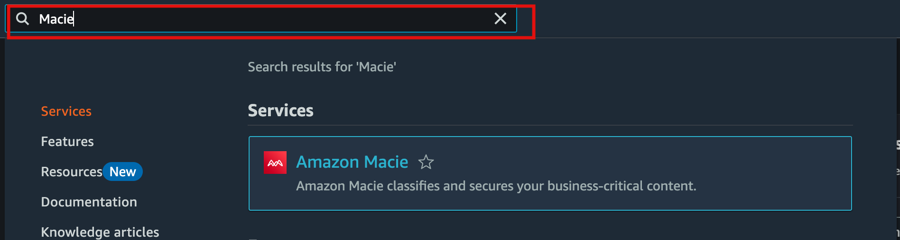
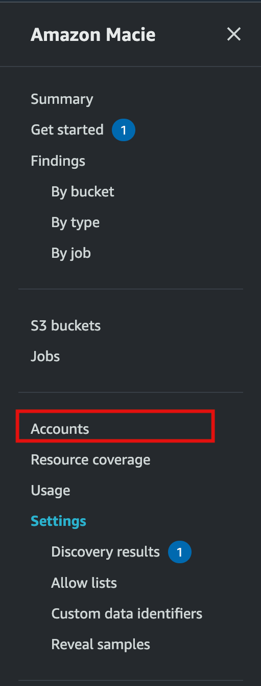
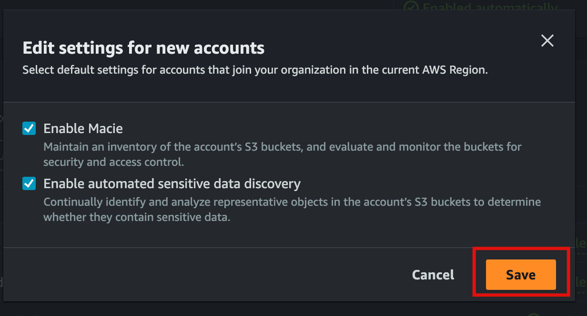

# Create Organization OUs

**Last reviewed:** 27 March 2024

## Steps

### Create OUs in the AWS Console

1. Log in to the Management Account and navigate to Organizations, ensure you are in the correct region.
1. Create 3 new OUs:
   - `Workloads`
   - `Suspended`
   - `Sandbox`


---

### Add the Account to the SecurityHub Main Account

1. Login to the Audit Account and navigate to SecurityHub.
1. Go the Accounts section under Settings > Configuration and Enable the new account


### Add the Account to the CDK Project

1. Add the new account details to the `DataLandingZoneProps` properties being passed to the DataLandingZone component.
2. Run the bootstrap TS script:

```ts
import { scripts } from 'data-landing-zone';
...
await scripts.bootstrap.all(config);
...
```

---

## Enabling Amazon Macie for an AWS Organization

Amazon Macie is a security service that uses machine learning to automatically discover, classify, and protect sensitive data in AWS. In this guide, we will walk through enabling Macie for your AWS Organization, designating an administrator account, and configuring it to be enabled automatically on new accounts.

### Prerequisites

- You must be using AWS Organizations and have **all features** enabled.
- You need to have **administrator access** to the organization's management account.
- Ensure that you have permissions to create or designate service-linked roles for Macie.

---

### Step 1: Enable Amazon Macie in the Management Account

1. Sign in to the AWS Management Console using the management account of your AWS Organization.
2. In the **Search bar**, type and select **Macie** to open the Amazon Macie console.

3. If Macie is not already enabled:
   - On the Macie Dashboard, click **Get Started**.
    
   - If you are ready to designate a Macie administrator account, enter the AWS account ID of the **Audit Account** to designate as the Macie administrator in the **Delegated administrator account** text box, and click **Delegate**.
    
   - Review the information, then click **Enable Macie**.
    

This will enable Macie for the management account.

---

### Step 2: Automatically Enable Macie for New Accounts

After designating an administrator account, you can configure Macie to be enabled automatically for all new accounts added to your AWS Organization.

1. Login to the **Administrator** account for Macie.
2. Go the the **Amazon Macie console**.
3. Select the **Accounts** link in the sidebar.

4. From the Accounts panel click **Edit** button.

5. With the popup dialog open, review the settings and toggle:
   - **Enable Macie** to enable Macie for new accounts.
   - **Enable automated sensitive data discovery** to enable automated discovery of sensitive data in the account’s S3 buckets.
6. When you are done, click **Save**.


This ensures that every new account created or invited into the AWS Organization will automatically have Macie enabled and linked to the administrator account.

---
