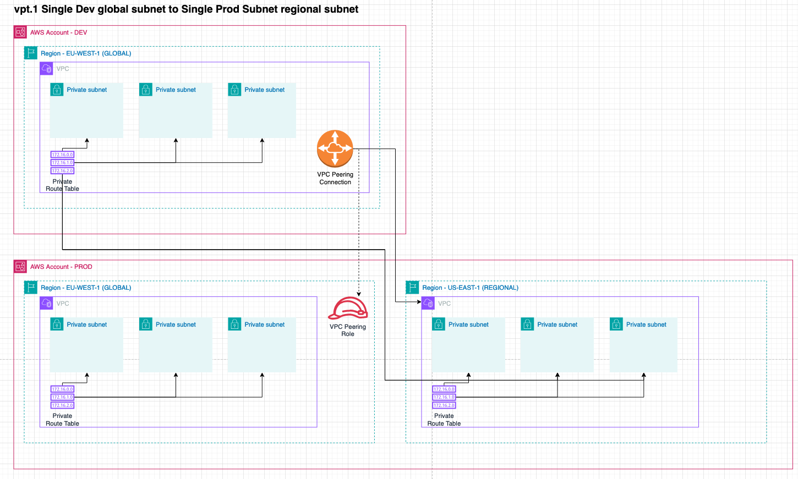

# Network Addressing

**Status:** accepted

**Deciders:** Rehan van der Merwe

**Last updated:** 2024-10-01

## Context

We need to be able to address and access network resources across accounts internally (within the DLZ construct) and 
externally (within the DLZ construct config). For external use,
we need the user to somehow specify a specific account's VPC, routing tables, and subnets. To create connections like
VPC Peering, Transit Gateway and CloudWan routes.

Internally we need to know how to address resources the user specifies. For example, if the user specifies a VPC, we need
to know where to get the actual deployed resource to get its ID that we need to use in another resource.

## Decision

An account and its network are defined in the `DataLandingZoneProps` object as below.
```typescript
          {
            name: 'development',
            accountId: '381491899779',
            type: DlzAccountType.DEVELOP,
            vpcs: [
              {
                name: 'default',
                region: Region.US_EAST_1,
                cidr: '10.1.0.0/16',
                subnets: [
                  /* Evenly divide, each /19 = 8k hosts */
                  {
                    routeTable: 'private',
                    name: 'private-1',
                    cidr: '10.1.0.0/19',
                    az: 'us-east-1a',
                  },
                  {
                    routeTable: 'private',
                    name: 'private-2',
                    cidr: '10.1.32.0/19',
                    az: 'us-east-1b',
                  },
                  {
                    routeTable: 'private',
                    name: 'private-3',
                    cidr: '10.1.64.0/19',
                    az: 'us-east-1c',
                  },
                  
                  {
                    routeTable: 'public',
                    name: 'public-1',
                    cidr: '10.1.96.0/19',
                    az: 'us-east-1a',
                  },
                  {
                    routeTable: 'public',
                    name: 'public-2',
                    cidr: '10.1.128.0/19',
                    az: 'us-east-1a',
                  },
                  {
                    routeTable: 'public',
                    name: 'public-3',
                    cidr: '10.1.160.0/19',
                    az: 'us-east-1a',
                  }
                ]
              }
            ],
          },
```

We decided on a weekly typed string schema that represents a network entity, where an entity here can mean everything in
an account, vpc, region, subnet or subnet:
```typescript
NetworkAddress.fromString("account.region.vpc.routeTable.subnet")
//OR
new NetworkAddress('account', 'region', 'vpc', 'routeTable', 'subnet')
```

For example, with this we can make selections like:

- `development.us-east-1.default.private.private-1`: Select the first private subnet in the default VPC in the 
   development account in the us-east-1 region.
- `development.us-east-1.default.private`: Select all the private subnets in the default VPC in the development 
   account in the us-east-1 region.
- `development.us-east-1.default`: Select all the route tables and all their respective subnets in the default
   VPC in the development account in the us-east-1 region.
- `development.us-east-1`: Select all the VPCs and their respective route tables and subnets in the development 
   account in the us-east-1 region.
- `development`: Select all the VPCs, route tables and subnets in the development account in all the regions.

This allows us to make VPC Peering connections like:
```typescript
  ...
  vpcPeering: [
    {
      source: new NetworkAddress('development','eu-west-1', 'default', 'private'),
      destination: NetworkAddress.fromString('production.us-east-1.default.private'),
    },
  ],
  ...
};
```
Indicating to make a VPC Peering Connection:
- **From**: the development account's eu-west-1 region's default VPC's private 
- **To**: the production account's us-east-1 region's default VPC's private subnet.

It's easier to understand when visually represented:


## Consequences

The schema is easy to work with and understand. It allows us to easily select and address network resources across 
accounts and regions. It also makes it easy to reconstruct SSM Parameter Store paths, to look up resource that is not in
the current account and region.

For example, the following are SSM Parameter store paths and what they return: 
- `/dlz/networking-entity/vpc/development.us-east-1.default/id` would return the VPC ID of the default VPC in the 
  development account in the us-east-1 region.
- `/dlz/networking-entity/vpc/development.us-east-1.default.private/id` would return the route table ID of the private 
  subnet in the default VPC in the development account in the us-east-1 region.

With the help of the `DlzSsmReader` we can look these SSM values up in the account they are defined if we know the
address they are stored at, which we do because the user specifies the network address. 
