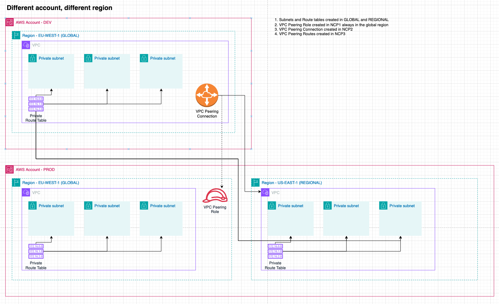

# VPC Peering

## Test images 

### VPC Peering 

### vpt.1 Single Dev Subnet to Single Prod Subnet - Different region

1. Subnets and Route tables created in GLOBAL and REGIONAL
2. VPC Peering Role created in NCP1
3. VPC Peering Connection + Peering Routes created in NCP2

