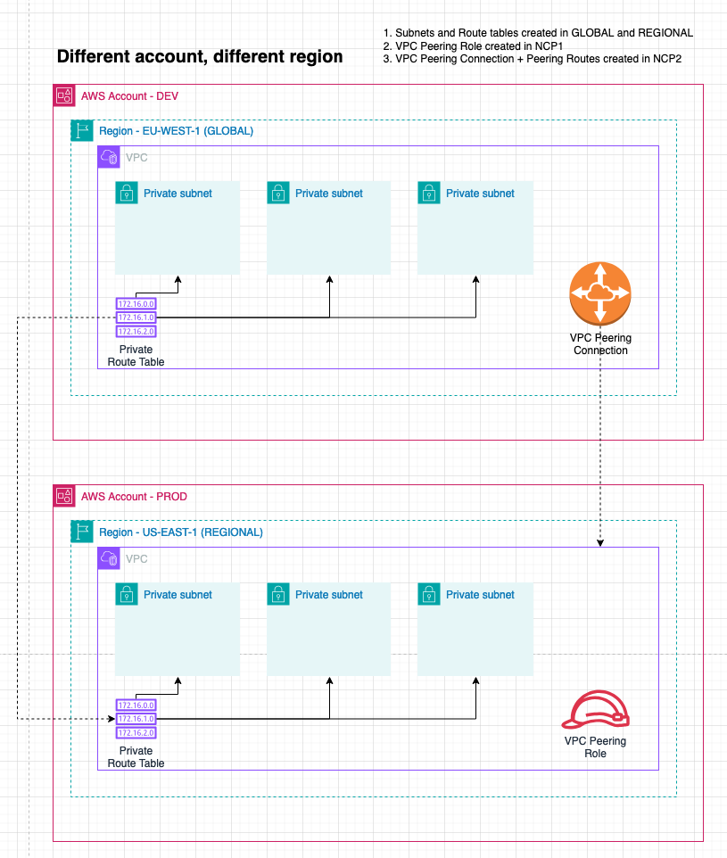

# VPC Peering

## Test images 

### VPC Peering 

### vpt.1 Single Dev Subnet to Single Prod Subnet - Different region

1. Subnets and Route tables created in GLOBAL and REGIONAL
2. VPC Peering Role created in NCP1 always in the global region
3. VPC Peering Connection created in NCP2
4. VPC Peering Routes created in NCP3

