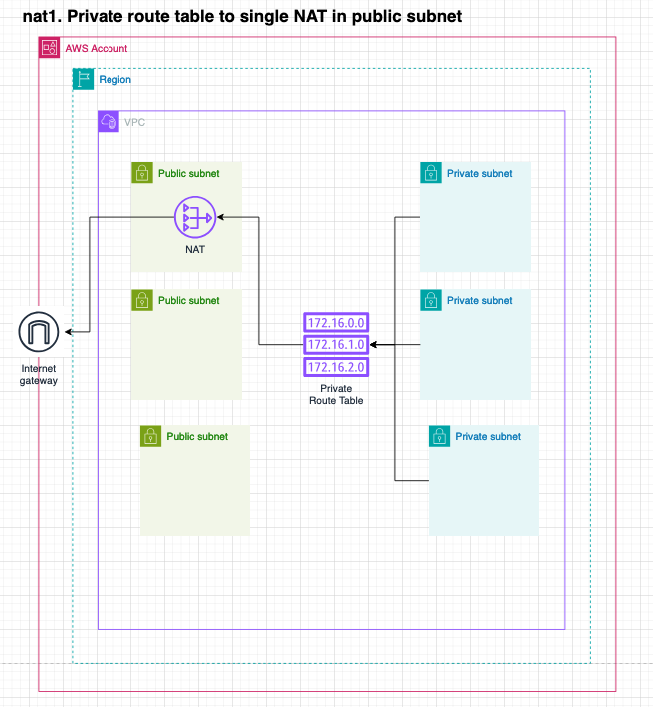

# Network Address Translation (NAT)

## Provisioned resources

The NAT resources are provisioned in the `Regional` and `Global` stacks with the `dlz-vpc` construct. 

Specifying a NAT will create:
- A single Internet Gateway
- NAT Gateway/Instance
- Routes in the route table of the NATs pointing all outbound traffic (`0.0.0.0/0`) to the Internet Gateway
- Routes in the route table of all the `from` addresses, pointing all outbound traffic (`0.0.0.0/0`) to the 
  NAT Gateway/Instance

## Important notes

- NAT routing can only work within a VPC. VPC peering is the only cross network solution supported for the DLZ at the moment.
  VPC Peering is hub-spoke connections, this limits the traffic flow from the source, and it can not leave the 
  destination in any form. So the source traffic can not leave through the NAT in the destination.

## Configuration examples and tests

NATs can be configured in the `DataLandingZoneProps` object within the `network.nats`
property. Each configuration and test will use the `development` account's first VPC.

```ts
const configBase: DataLandingZoneProps = {
    ...
    ous: {
      ...
      workloads: {
        ouId: 'ou-vh4d-nc2zzf9z',
        accounts: [
          {
            name: 'development',
            accountId: '381491899779',
            type: DlzAccountType.DEVELOP,
            vpcs: [
              Defaults.vpcClassB3Private3Public(0, Region.US_EAST_1), // CIDR 10.0.0./19
            ],
          },
        ],
      },
    },
  },
  network: {
    nats: [
      
    ]
  },

  printDeploymentOrder: false,
  saveReport: false,
  printReport: false,
};
```

The following tests showcase the different configurations and the expected results. They are accompanied by an
Architecture diagram to mentally visualize the setup that will and needs to be created. These tests can be found in the
`/tests/nats.test.ts` file. The name of the test corresponds to the name of the expected results and diagram below.

### nat.1 Private route table to single NAT in public subnet - NAT GW

The default VPC has two RouteTables according to the `Defaults.vpcClassB3Private3Public` function. A private route table
and a public route table. 

In the configuration below, the NAT is placed in the `public-1` subnet and the `private` route table is configured to
route all outbound traffic to the NAT.

```ts
const config: DataLandingZoneProps = {
  ...configBase,
  network: {
    nats: [
      {
        name: "development-eu-west-1-internet-access",
        location: new NetworkAddress('development', Region.EU_WEST_1, 'default', 'public', 'public-1'),
        allowAccessFrom: [
          new NetworkAddress('development', Region.EU_WEST_1, 'default', 'private')
        ],
        type: {
          gateway: {}
        }
      }
    ]
  },
};
```



### nat.1 Private route table to single NAT in public subnet - NAT Instance

The same concept and image applies to this test as in the previous one. The only difference is that the NAT is an
EC2 Instance configured to be a NAT Gateway. To use a NAT Instance instead of a NAT Gateway change your configuration
to: 

```ts
const config: DataLandingZoneProps = {
  ...configBase,
  network: {
    nats: [
      {
        name: "development-eu-west-1-internet-access",
        location: new NetworkAddress('development', Region.EU_WEST_1, 'default', 'public', 'public-1'),
        allowAccessFrom: [
          new NetworkAddress('development', Region.EU_WEST_1, 'default', 'private')
        ],
        type: {
          instance: {
            instanceType: InstanceType.of(InstanceClass.T3, InstanceSize.MICRO),
          }
        }
      }
    ]
  },
};
```


### nat.2 Each route tables in the private subnet/AZ routes a NAT in the same public subnet AZ

For this test we override the VPC configuration of the `development` account to have a private subnet, public subnet
and a route table per AZ.

```ts
const region = Region.EU_WEST_1;
const thirdOctetMask = 0;
configBase.organization.ous.workloads.accounts[0]['vpcs'] = [
  {
    name: 'default',
    region: region,
    cidr: '10.'+thirdOctetMask+'.0.0/16',
    routeTables: [
      {
        name: 'private-1',
        subnets: [
          {
            name: 'private-1-s',
            cidr: '10.'+thirdOctetMask+'.0.0/19',
            az: region+'a',
          },
        ],
      },
      {
        name: 'private-2',
        subnets: [
          {
            name: 'private-2-s',
            cidr: '10.'+thirdOctetMask+'.32.0/19',
            az: region+'b',
          },
        ],
      },
      {
        name: 'private-3',
        subnets: [
          {
            name: 'private-3-s',
            cidr: '10.'+thirdOctetMask+'.64.0/19',
            az: region+'b',
          },
        ],
      },

      {
        name: 'public-1',
        subnets: [
          {
            name: 'public-1-s',
            cidr: '10.'+thirdOctetMask+'.96.0/19',
            az: region+'a',
          },
        ],
      },
      {
        name: 'public-2',
        subnets: [
          {
            name: 'public-2-s',
            cidr: '10.'+thirdOctetMask+'.128.0/19',
            az: region+'b',
          },
        ],
      },
      {
        name: 'public-3',
        subnets: [
          {
            name: 'public-3-s',
            cidr: '10.'+thirdOctetMask+'.160.0/19',
            az: region+'c',
          },
        ],
      },
    ],
  },
];
```

Then we configure the traffic to flow from the private route table to the NAT in the public subnet of that AZ. Ensuring
no traffic leaves the AZ, creating a Highly Available and Resilient architecture.

```ts
    const config: DataLandingZoneProps = {
  ...configBase,
  network: {
    nats: [
      {
        name: "development-eu-west-1-internet-access-AZ-a",
        location: new NetworkAddress('development', Region.EU_WEST_1, 'default', 'public', 'public-1'),
        allowAccessFrom: [
          new NetworkAddress('development', Region.EU_WEST_1, 'default', 'private-1')
        ],
        type: {
          gateway: {}
        }
      },
      {
        name: "development-eu-west-1-internet-access-AZ-b",
        location: new NetworkAddress('development', Region.EU_WEST_1, 'default', 'public', 'public-2'),
        allowAccessFrom: [
          new NetworkAddress('development', Region.EU_WEST_1, 'default', 'private-2')
        ],
        type: {
          gateway: {}
        }
      },
      {
        name: "development-eu-west-1-internet-access-AZ-c",
        location: new NetworkAddress('development', Region.EU_WEST_1, 'default', 'public', 'public-3'),
        allowAccessFrom: [
          new NetworkAddress('development', Region.EU_WEST_1, 'default', 'private-3')
        ],
        type: {
          gateway: {}
        }
      }
    ]
  },
};
```

