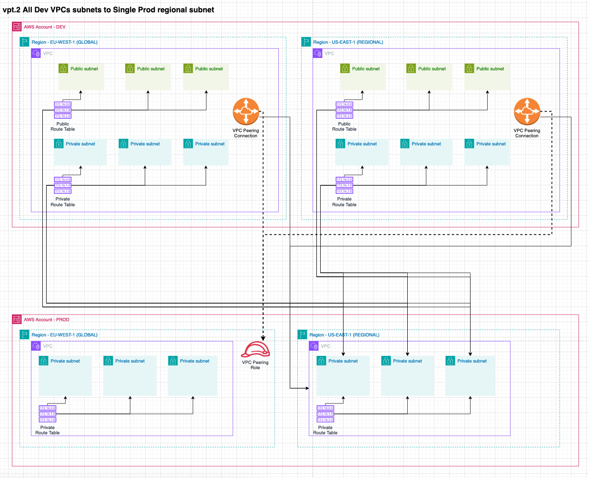
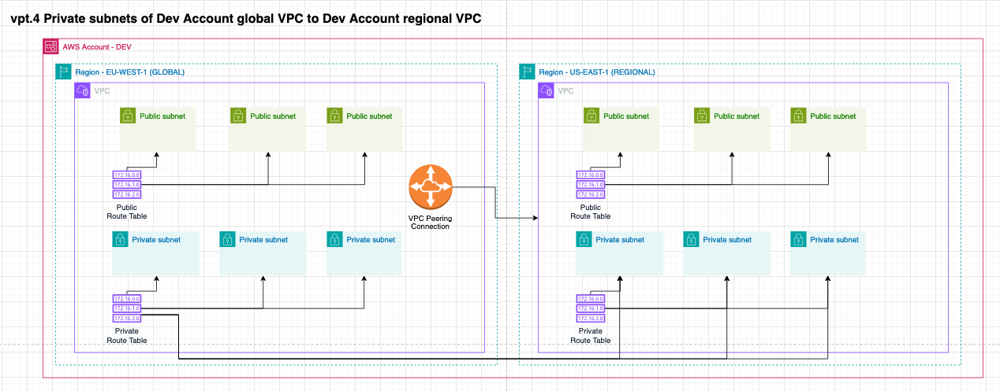
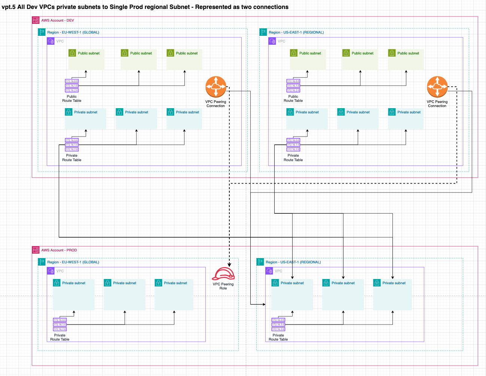

# VPC Peering

## Order of deployment:

1. Subnets and Route tables are created in GLOBAL and REGIONAL
2. A VPC Peering Role is created in NCP1 always in the GLOBAL region (because IAM is a global service) of the 
   destination account. It will not be created if both VPCs are in the same account.
3. VPC Peering Connection(s) are created in NCP2 from the source to the destination. The VPC Peering Connection 
   in the destination account has the exact same ID as in the source. We can not create another VPC Peering Connection
   but instead have to get the ID from the source account (which ,as mentioned, is the same in the destination account).
4. VPC Peering Routes created in NCP3 for both source and destination.

These phases/waves are required to ensure that all resources from the previous phase are available for the next phase.
Consider that two VPCs in different accounts need to be peered. The peering role needs to be defined in the destination 
account first before the VPC Peering connection can be created in the source account. We can not use `.addDependency`
as the resources are not in the same stack.

## Important notes

- VPC Peering is hub-spoke connection and the traffic can not leave the spoke (the destination account). 
- VPC Peering enables both VPCs to communicate with each other, traffic can not be restricted to flow one-way. 
  Access to other VPC can be controlled with Security Groups, but it can not be granted or denied on a networking level.
- VPC Peering can not be used to send all traffic to a central egress account, because of the hub-spoke limitation,
  traffic can not leave the destination VPC through a NAT.
- A VPC Peering Role is not created within the same account between VPCs.
- There is a limit to the number of Routes in a RouteTable. The default is 50 but it can easily be increased to 1000
  with a service quota limit request.

## Configuration examples and tests

VPC Peering can be configured in the `DataLandingZoneProps` object within the `network.connections.vpcPeering` 
property. Each configuration and test will use these accounts and VPCs to showcase different setups.

```ts
const configBase: DataLandingZoneProps = {
    ...
    ous: {
      ...
      workloads: {
        ouId: 'ou-vh4d-nc2zzf9z',
        accounts: [
          {
            name: 'development',
            accountId: '381491899779',
            type: DlzAccountType.DEVELOP,
            vpcs: [
              defaultVpcClasB3Private3Public(0, Region.US_EAST_1), // CIDR 10.0.0./19
              defaultVpcClasB3Private3Public(1, Region.EU_WEST_1), // CIDR 10.1.0./19
            ],
          },
          {
            name: 'production',
            accountId: '234567890123',
            type: DlzAccountType.PRODUCTION,
            vpcs: [
              defaultVpcClasB3Private3Public(2, Region.US_EAST_1), // CIDR 10.2.0./19
              defaultVpcClasB3Private3Public(3, Region.EU_WEST_1), // CIDR 10.3.0./19
            ],
          },
        ],
      },
    },
  },
  network: {
    connections: {
      vpcPeering: [

      ],
    },
  },

  printDeploymentOrder: false,
  saveReport: false,
  printReport: false,
};
```

The following tests showcase the different configurations and the expected results. They are accompanied by an 
Architecture diagram to mentally visualize the setup that will and needs to be created. These tests can be found in the 
`/tests/vpc-peering.test.ts` file. The name of the test corresponds to the name of the expected results and diagram below.

### vpt.1 Single Dev global subnet to Single Prod Subnet regional subnet

```ts
const config: DataLandingZoneProps = {
  ...configBase,
  network: {
    connections: {
      vpcPeering: [
        {
          source: new NetworkAddress('development', Region.EU_WEST_1, 'default', 'private'),
          destination: NetworkAddress.fromString('production.us-east-1.default.private'),
        },
      ],
    },
  },
};
```


### vpt.2 All Dev VPCs subnets to Single Prod regional subnet

```ts
const config: DataLandingZoneProps = {
  ...configBase,
  network: {
    connections: {
      vpcPeering: [
        {
          source: new NetworkAddress('development'),
          destination: NetworkAddress.fromString('production.us-east-1.default.private'),
        },
      ],
    },
  },
};
```




### vpt.3 All Dev VPCs Subnets to all Prod VPCs Subnets

```ts
const config: DataLandingZoneProps = {
  ...configBase,
  network: {
    connections: {
      vpcPeering: [
        {
          source: new NetworkAddress('development'),
          destination: NetworkAddress.fromString('production'),
        },
      ],
    },
  },
};
```


### vpt.4 Private subnets of Dev Account global VPC to Dev Account regional VPC

```ts
const config: DataLandingZoneProps = {
  ...configBase,
  network: {
    connections: {
      vpcPeering: [
        {
          source: new NetworkAddress('development', Region.EU_WEST_1, 'default', 'private'),
          destination: new NetworkAddress('development', Region.US_EAST_1, 'default', 'private'),
        },
      ],
    },
  },
};
```



### vpt.5 All Dev VPCs private subnets to Single Prod regional Subnet - Represented as two connections

```ts
const config: DataLandingZoneProps = {
  ...configBase,
  network: {
    connections: {
      vpcPeering: [
        {
          source: new NetworkAddress('development', Region.EU_WEST_1, 'default', 'private'),
          destination: NetworkAddress.fromString('production.us-east-1.default.private'),
        },
        {
          source: new NetworkAddress('development', Region.US_EAST_1, 'default', 'private'),
          destination: NetworkAddress.fromString('production.us-east-1.default.private'),
        },
      ],
    },
  },
};
```



## FAQ

### Why use VPC Peering?

- There is no extra charges(fixed or variable) for a VPC Peering Connection.
- Data transfer between AZ, regardless of the same account or not, is free. You only pay standard EC2 data transfer 
  rates if data crosses AZ and Regions. This makes for cost-effective data transfer between Accounts and VPCs. 
  Especially for large data transfers between Accounts and VPCs in the same Region and AZ.
- You accept the hub-spoke architecture and do not need a central egress point for all traffic. I many cases it is 
  a better alternative to a central egress account that has a NAT Gateway. This can be done with Transit Gateway, 
  where you pay an hourly fee for the attachment and the data transfer. Transit Gateway data pricing is ~4 times more
  expensive than that of a NAT Gateway, not considering that you still need to pay for the NAT Gateway data pricing. 
  So in many cases it's better to have a NAT Gateway(s)/Instance(s) in each VPC, on a cost and reliability basis, 
  as you won't have a single point of failure.

### Why not use VPC Peering?

- VPC Peering is not transitive. If you have VPC A peered with VPC B and VPC B peered with VPC C, then VPC A can not 
  communicate with VPC C. You would need to create a VPC Peering Connection between VPC A and VPC C. This is where the 
  term hub-spoke comes from. The hub is the source VPC and the spokes are the destination VPCs. It is a one-to-one
  connection.
- When you have a lot of Accounts that need to communicate to each other. The maximum number of Routes in a RouteTable
  is 1000. If we consider an example where you have 10 accounts, and you want to connect all their private subnets (3)
  with each other. Then each route table will have 9 * 3 = 27 Peering Routes. It might not seem that much, but it  
  does not scale well if you have many more accounts and multiple VPCs within an account. 
- If you want a central egress point for all traffic. VPC Peering can not be used, because of the hub-spoke limitation,
  traffic can not leave the destination in any form (unless you proxy it manually, you should not).
