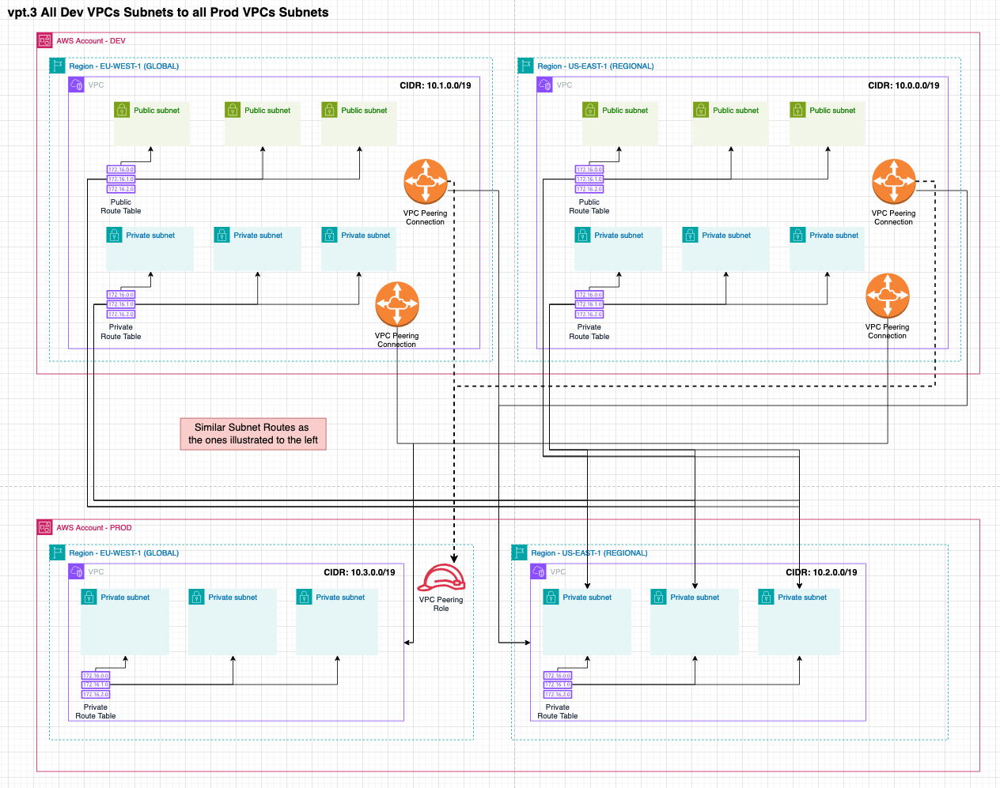

# VPC Peering

## Order of deployment:

1. Subnets and Route tables are created in GLOBAL and REGIONAL
2. A VPC Peering Role is created in NCP1 always in the GLOBAL region of the destination account. It will not be
   created if both VPCs are in the same account.
3. VPC Peering Connection(s) are created in NCP2 from the source the destination only. The VPC Peering Role connection 
   in the destination account has the exact same ID as in the source. We can not create another Peering Connection but
   have to get the ID from the source account. It will not be  created if both VPCs are in the same account.
4. VPC Peering Routes created in NCP3

These phases/waves are required to ensure that all resources from the previous phase are available for the next phase.
Consider that two VPC in different accounts need to be peered. The peering role needs to be defined in the destination 
account first before the VPC Peering connection can be created in the source account. We can not use `.addDependency`
as the resources are not in the same stack.

## Important notes

- VPC Peering is transitive, meaning traffic can only flow from beyond the peered VPCs, in other words it will always 
  be a hub-spoke connection and the traffic can not leave the spoke. 
- VPC Peering enables both VPCs to communicate with each, traffic can not be restricted to flow one-way. That can be 
  controlled with Security Groups.
- VPC Peering can not be used to send all traffic to a central egress account, because it is transitive, the traffic
  can not leave the VPC through a NAT.
- A VPC Peering Role is not created within the same account between VPCs.
- There is a limit to the number of Routes in a RouteTable. The default is 50 but it can easily be increased to 1000
  with a service quota limit request. 

## Configuration examples and tests

The VPC Peering can be configured in the `DataLandingZoneProps` object within the `network.connections.vpcPeering` 
property. Each configuration and test will use these accounts and VPCs to showcase different setups.

```ts
const configBase: DataLandingZoneProps = {
    ...
    ous: {
      ...
      workloads: {
        ouId: 'ou-vh4d-nc2zzf9z',
        accounts: [
          {
            name: 'development',
            accountId: '381491899779',
            type: DlzAccountType.DEVELOP,
            vpcs: [
              defaultVpcClasB3Private3Public(0, Region.US_EAST_1), // CIDR 10.0.0./19
              defaultVpcClasB3Private3Public(1, Region.EU_WEST_1), // CIDR 10.1.0./19
            ],
          },
          {
            name: 'production',
            accountId: '234567890123',
            type: DlzAccountType.PRODUCTION,
            vpcs: [
              defaultVpcClasB3Private3Public(2, Region.US_EAST_1), // CIDR 10.2.0./19
              defaultVpcClasB3Private3Public(3, Region.EU_WEST_1), // CIDR 10.3.0./19
            ],
          },
        ],
      },
    },
  },
  network: {
    connections: {
      vpcPeering: [

      ],
    },
  },

  printDeploymentOrder: false,
  saveReport: false,
  printReport: false,
};
```

The following tests showcase the different configurations and the expected results. They are accompanied by an 
Architecture diagram to mentally visualize the setup than will and needs to be created. These tests can be found in the 
`/tests/vpc-peering.test.ts` file.

### vpt.1 Single Dev global subnet to Single Prod Subnet regional subnet

```ts
const config: DataLandingZoneProps = {
  ...configBase,
  network: {
    connections: {
      vpcPeering: [
        {
          source: new NetworkAddress('development', Region.EU_WEST_1, 'default', 'private'),
          destination: NetworkAddress.fromString('production.us-east-1.default.private'),
        },
      ],
    },
  },
};
```


### vpt.2 All Dev VPCs subnets to Single Prod regional subnet

```ts
const config: DataLandingZoneProps = {
  ...configBase,
  network: {
    connections: {
      vpcPeering: [
        {
          source: new NetworkAddress('development'),
          destination: NetworkAddress.fromString('production.us-east-1.default.private'),
        },
      ],
    },
  },
};
```


### vpt.3 All Dev VPCs Subnets to all Prod VPCs Subnets

```ts
const config: DataLandingZoneProps = {
  ...configBase,
  network: {
    connections: {
      vpcPeering: [
        {
          source: new NetworkAddress('development'),
          destination: NetworkAddress.fromString('production'),
        },
      ],
    },
  },
};
```



### vpt.4 Private subnets of Dev Account global VPC to Dev Account regional VPC

```ts
const config: DataLandingZoneProps = {
  ...configBase,
  network: {
    connections: {
      vpcPeering: [
        {
          source: new NetworkAddress('development', Region.EU_WEST_1, 'default', 'private'),
          destination: new NetworkAddress('development', Region.US_EAST_1, 'default', 'private'),
        },
      ],
    },
  },
};
```


### vpt.5 All Dev VPCs private subnets to Single Prod regional Subnet - Represented as two connections

```ts
const config: DataLandingZoneProps = {
  ...configBase,
  network: {
    connections: {
      vpcPeering: [
        {
          source: new NetworkAddress('development', Region.EU_WEST_1, 'default', 'private'),
          destination: NetworkAddress.fromString('production.us-east-1.default.private'),
        },
        {
          source: new NetworkAddress('development', Region.US_EAST_1, 'default', 'private'),
          destination: NetworkAddress.fromString('production.us-east-1.default.private'),
        },
      ],
    },
  },
};
```


