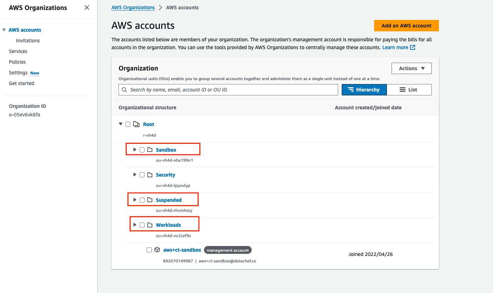

# Create Organization OUs

**Last reviewed:** 27 March 2024

## Steps

### Create OUs in the AWS Console

1. Log in to the Management Account and navigate to Organizations, ensure you are in the correct region.
1. Create 3 new OUs:
   - `Workloads`
   - `Suspended`
   - `Sandbox`

