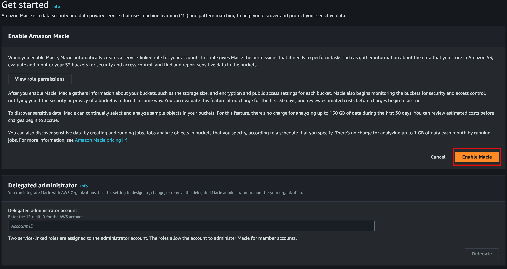

# Create an AWS Account

**Last reviewed:** 27 March 2024

## Steps

### Create Account in the AWS Console

> [!CAUTION]
> Ensure that the [Account Factory Settings](Account%20Factory%20Settings.md) are correct before creating the account.

1. Log in to the Management Account and navigate to Control Tower (CT), ensure you are in the correct region.
1. Click on the `Account Factory` in the left-hand menu. Then on `Create Account`.
1. Fill all the details in. 
   - Make sure that the email address exists and is unique. Use "plus aliasing" if you need to create multiple accounts
     with the same email address.
   - Choose the correct OU, according to the account that you are creating:
      - `Workloads` OU 
        - `Production` account
        - `Develop` account
     
       If you hae not created the OUs yet, you can do so now by following the steps in
       [Create Organization OUs](Create%20Organization%20OUs.md). 
   

1. Check your email address, you will recieve 2 emails, the one has the invitation link for the SSO user we specified.

1. Choose a password.

1. Login with the SSO user and set up MFA. Select tje Authenticator app, and click on Next. Click on Show QR code,
enlarge th web page ans use 1Password to capture the screen and read the QR code. Then enter the QR code to finish the 
setup.

1. You should now be able to log into the account with the SSO user.

1. Make note of the account ID as we will need it for the next steps.

### Add the Account to the SecurityHub Main Account

1. Login to the Audit Account and navigate to SecurityHub.
1. Go the Accounts section under Settings > Configuration and Enable the new account


### Add the Account to the CDK Project

1. Add the new account details to the `DataLandingZoneProps` properties being passed to the DataLandingZone component. 
1. Run the bootstrap TS script:
```ts
import { scripts } from 'data-landing-zone';
...
await scripts.bootstrap.all(config);
...
```

---

## Enabling Amazon Macie for an AWS Organization

Amazon Macie is a security service that uses machine learning to automatically discover, classify, and protect sensitive data in AWS. In this guide, we will walk through enabling Macie for your AWS Organization, designating an administrator account, and configuring it to be enabled automatically on new accounts.

### Prerequisites

- You must be using AWS Organizations and have **all features** enabled.
- You need to have **administrator access** to the organization's management account.
- Ensure that you have permissions to create or designate service-linked roles for Macie.

---

### Step 1: Enable Amazon Macie in the Management Account

1. Sign in to the AWS Management Console using the management account of your AWS Organization.
2. In the **Search bar**, type and select **Macie** to open the Amazon Macie console.

3. If Macie is not already enabled:
   - On the Macie Dashboard, click **Get Started**.
    
   - If you are ready to designate a Macie administrator account, enter the AWS account ID of the Audit Account to designate as the Macie administrator in the **Delegated administrator account** text box, and click **Delegate**.
    
   - Review the information, then click **Enable Macie**.
    

This will enable Macie for the management account.

---

### Step 2: Automatically Enable Macie for New Accounts

After designating an administrator account, you can configure Macie to be enabled automatically for all new accounts added to your AWS Organization.

1. Login to the **Administrator** account for Macie.
2. Go the the **Amazon Macie console**.
3. Select the **Accounts** link in the sidebar.

4. From the Accounts panel click **Edit** button.

5. With the popup dialog open, review the settings and toggle:
   - **Enable Macie** to enable Macie for new accounts.
   - **Enable automated sensitive data discovery** to enable automated discovery of sensitive data in the account’s S3 buckets.
6. When you are done, click **Save**.


This ensures that every new account created or invited into the AWS Organization will automatically have Macie enabled and linked to the administrator account.

---
