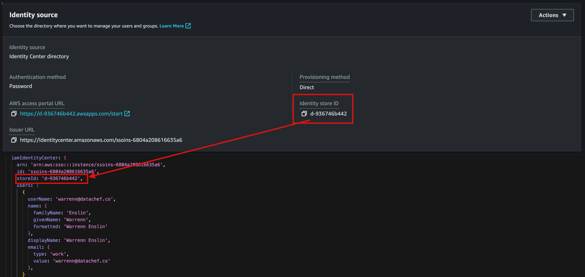

# AWS IAM Identity Center

*AWS IAM Identity Center* (formerly known as AWS Single Sign-On) is a service that simplifies access management by allowing users to sign in to multiple AWS accounts and applications with a single set of credentials. It integrates with external identity providers (IdPs) or can use an internal directory.

## Table of Contents

- [AWS IAM Identity Center](#aws-iam-identity-center)
  - [Table of Contents](#table-of-contents)
  - [Differences between External Identity Provider and Internal Directory](#differences-between-external-identity-provider-and-internal-directory)
  - [Step 1 - Setup AWS IAM Identity Center](#step-1---setup-aws-iam-identity-center)
  - [Step 2 - Configre DLZ properties to use AWS IAM Identity Center](#step-2---configre-dlz-properties-to-use-aws-iam-identity-center)
    - [Key Settings for IAM Identity Center](#key-settings-for-iam-identity-center)

---

## Differences between External Identity Provider and Internal Directory

1. External Identity Provider:

   - Uses an existing external IdP like Google, Microsoft Azure AD, or Okta.
   - Users authenticate through the external system, and AWS IAM Identity Center federates their access based on permissions set within AWS.
   - Useful for organizations already managing users with an external IdP to centralize identity management.
   - Supports standards like SAML 2.0 or OIDC for authentication.

1. Internal Directory (AWS IAM Identity Center Directory):
  
   - Manages users natively within AWS IAM Identity Center without external dependencies.
   - Users are created, managed, and authenticated within the AWS environment.
   - Suitable for simpler setups or where no external IdP is in place.
   - Allows for direct user and group management within AWS.

**External IdPs** provide centralized identity management across multiple platforms, while the **Internal Directory** offers a built-in AWS solution for user management entirely within the AWS ecosystem.

---

## Step 1 - Setup AWS IAM Identity Center

AWS IAM Identity Center needs to be set up to use the internal or external user store. Follow the guides below to set up one or the other. ⚠️ **Choose one, do not do both.** 

- [Setting Up AWS IAM Identity Center Internal Provider](../Setting%20Up%20IAM%20Identity%20Center%20Internal/Setting%20Up%20IAM%20Identity%20Center%20Internal.md)
- [Setting Up AWS IAM Identity Center External Identity Provider](../Setting%20Up%20IAM%20Identity%20Center%20External/Setting%20Up%20IAM%20Identity%20Center%20External.md)

## Step 2 - Configre DLZ properties to use AWS IAM Identity Center

- In the IAM Identity Center dashboard, click on **Settings** in the sidebar.

### Key Settings for IAM Identity Center

**Managing instance**:

**Instance arn**:

**Identity store id**:

---
