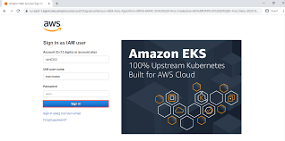
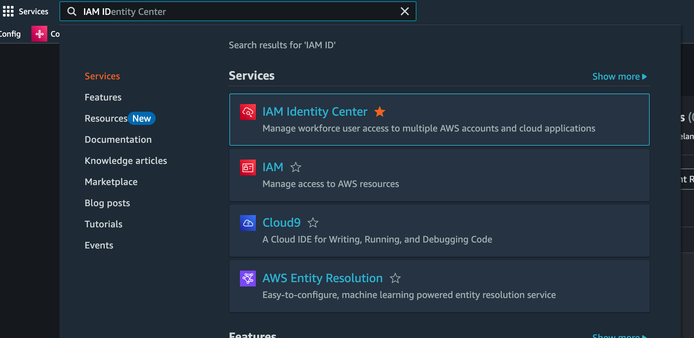
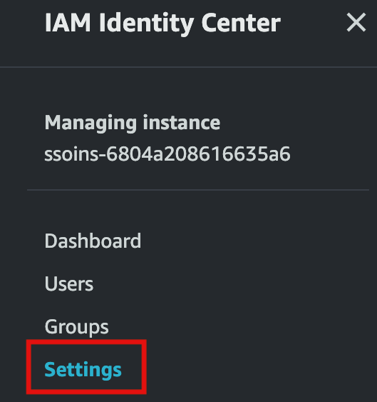
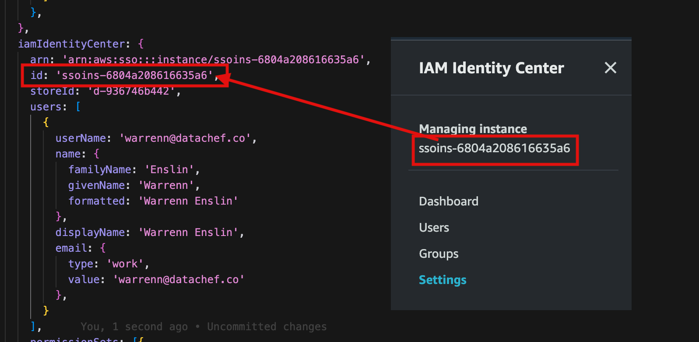

# Setting Up AWS IAM Identity Center Internal Provider

*AWS IAM Identity Center* (formerly known as AWS Single Sign-On) allows you to centrally manage access to multiple AWS accounts and applications. This guide provides a detailed, step-by-step process to set up IAM Identity Center in your AWS environment.

## Table of Contents

- [Setting Up AWS IAM Identity Center Internal Provider](#setting-up-aws-iam-identity-center-internal-provider)
  - [Table of Contents](#table-of-contents)
  - [Prerequisites](#prerequisites)
  - [Step 1: Sign In to the AWS Management Console](#step-1-sign-in-to-the-aws-management-console)
  - [Step 2: Navigate to AWS IAM Identity Center](#step-2-navigate-to-aws-iam-identity-center)
  - [Step 3: Enable IAM Identity Center](#step-3-enable-iam-identity-center)
  - [Step 4: Choose Your Identity Source](#step-4-choose-your-identity-source)
    - [Use IAM Identity Center as Your Identity Source](#use-iam-identity-center-as-your-identity-source)
  - [Step 5: IAM Identity Center Settings](#step-5-iam-identity-center-settings)
    - [Key Settings for IAM Identity Center](#key-settings-for-iam-identity-center)

---

## Prerequisites

Before you begin setting up AWS IAM Identity Center, ensure you have the following:

- **AWS Account**: Access to an AWS account with administrative privileges.
- **AWS CLI (Optional)**: Installed and configured if you plan to use command-line tools.
- **Browser**: A modern web browser to access the AWS Management Console.

---

## Step 1: Sign In to the AWS Management Console

1. **Action**: Open your web browser and navigate to the [AWS Management Console](https://aws.amazon.com/console/).

---

## Step 2: Navigate to AWS IAM Identity Center

- Once logged in, locate the **Find Services** search bar at the top of the console.
- Type **IAM Identity Center** and select it from the dropdown results.

---

## Step 3: Enable IAM Identity Center

- If this is your first time accessing IAM Identity Center, you will be prompted to enable it.
- Click on the **Enable IAM Identity Center** button.

---

## Step 4: Choose Your Identity Source

IAM Identity Center allows you to choose where your user identities are managed. You can use the built-in IAM Identity Center directory or connect to an external identity provider (IdP).

### Use IAM Identity Center as Your Identity Source

- Select **IAM Identity Center** as your identity source.
- Click **Save changes** if prompted.

---

## Step 5: IAM Identity Center Settings

- In the IAM Identity Center dashboard, click on **Settings** in the sidebar.

### Key Settings for IAM Identity Center

**Managing instance**:

**Instance arn**:

**Identity store id**:

