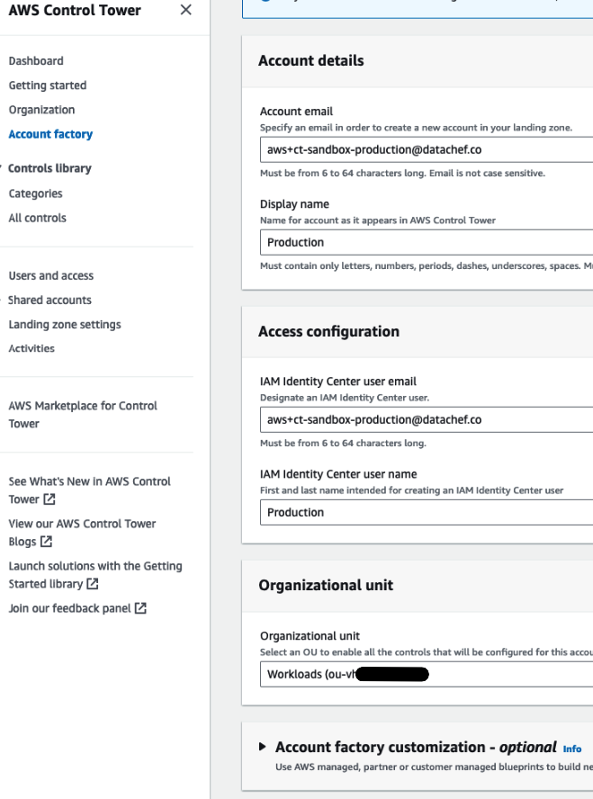
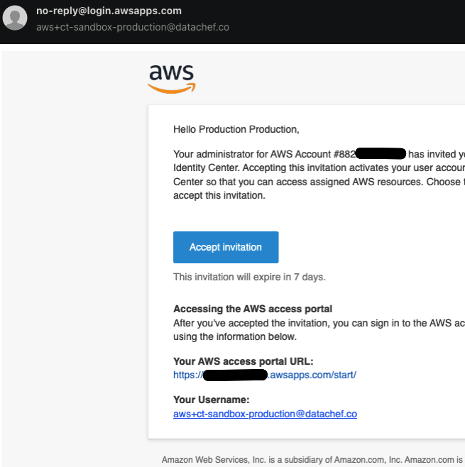
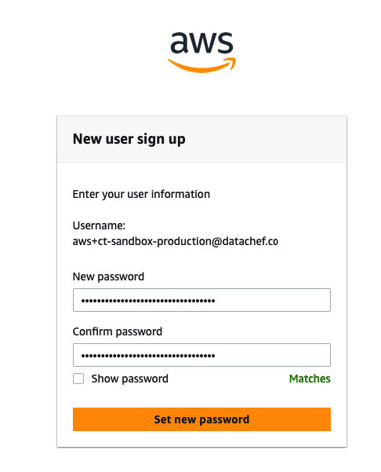
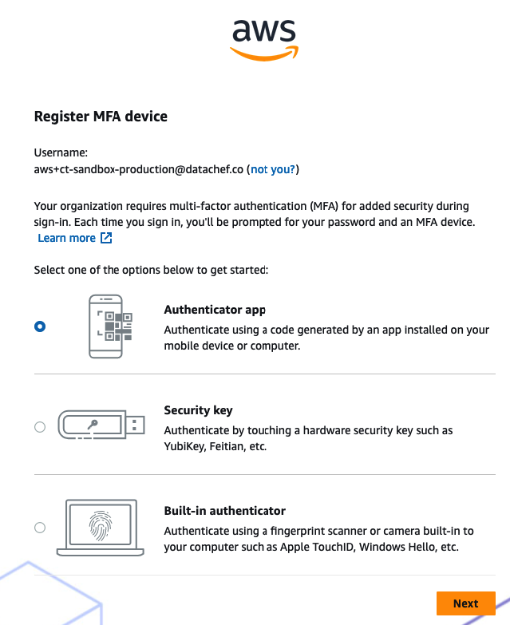
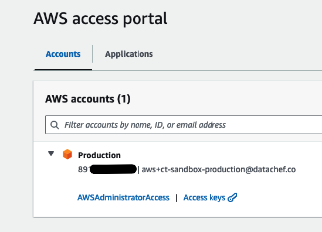

import DualCode from '../../../../components/DualCode.astro';

This Standard Operating Procedure (SOP) provides a guide on how to add a new or existing account to AWS Control Tower.

## Create a new Account

:::caution
Ensure that the [Account Factory network configuration](sop-initial-control-tower-setup#configure-account-factory)
is correctly set up before creating new accounts.
:::

https://docs.aws.amazon.com/controltower/latest/userguide/enroll-account.html

1. Log in to the Management Account and navigate to Control Tower (CT). Ensure you are in the correct region.
2. Click on **Account Factory** in the left-hand menu, then select **Create Account**.
3. Fill in all the required details:
- Ensure the email address exists and is unique. Use "plus aliasing" (e.g., `user+alias@example.com`) if you need
to create multiple accounts with the same email domain.
- Place the account under the `Workloads` OU.



4. Check your email inbox. You will receive two emails, one of which contains the invitation link for the specified
SSO user.



5. Follow the invitation link and choose a password for the SSO user.



6. Log in with the SSO user and set up MFA:
- Select **Authenticator app** and click **Next**.
- Use your preferred authenticator app to scan the QR code or manually enter the key and complete the process.



7. You should now be able to log in to the account using the SSO user.



8. Make a note of the new account ID. Add the account to the `workloads` OU in the CDK construct. Assign the account type:
- `DlzAccountType.DEVELOP` - Accounts with fewer security restrictions, designed to enhance the developer experience.
- `DlzAccountType.PRODUCTION` - Accounts requiring tight security measures, used for hosting production workloads.

<DualCode>
  <Fragment slot="ts">
    ```ts
    import {App} from 'aws-cdk-lib';
    import { DataLandingZone } from 'aws-data-landing-zone';

    const app = new App();
    const dlz = new DataLandingZone(app, {
      ...
      organization: {
          workloads: {
            ouId: 'ou-h2l0-gjr36ikn',
            accounts: [{
                name: 'ACCOUNT_NAME',
                accountId: 'ACCOUNT_ID',
                type: DlzAccountType.DEVELOP,
                ...
              }
            ]
          },
       },
       ...
     }
    });
    ```

  </Fragment>
  <Fragment slot="python">
    ```python
    #!/usr/bin/env python3
    import aws_cdk as cdk
    import aws_data_landing_zone as dlz

    app = cdk.App()
    dlz.DataLandingZone(app,
        ...
        organization=dlz.DLzOrganization(
                workloads=dlz.OrgOuWorkloads(
                    ou_id='ou-h2l0-gjr36ikn',
                    accounts=[
                        dlz.DLzAccount(
                            name='development',
                            account_id='123456789012',
                            type=dlz.DlzAccountType.DEVELOP,
                        ),
                    ],
                ),
            )
        ),
    )

app.synth()
````
  </Fragment>
</DualCode>

9. Run the `bootstrapAll` script or manually bootstrap the account using the AWS CDK. Refer to
[Scripts and Commands](/reference/scripts-commands) for detailed instructions.

Additional References:
- [Provision accounts with AWS Service Catalog Account Factory ](https://docs.aws.amazon.com/controltower/latest/userguide/provision-as-end-user.html)


## Enroll an existing Account

To enroll an existing account into Control Tower, follow the steps outlined in the
[official AWS documentation](https://docs.aws.amazon.com/controltower/latest/userguide/quick-account-provisioning.html).

## Additional Account Setup

See the [Account Setup](sop-account-setup) SOP for additional details on setting up one-time AWS Services and
integrations required for certain features to work in the Data Landing Zone.
