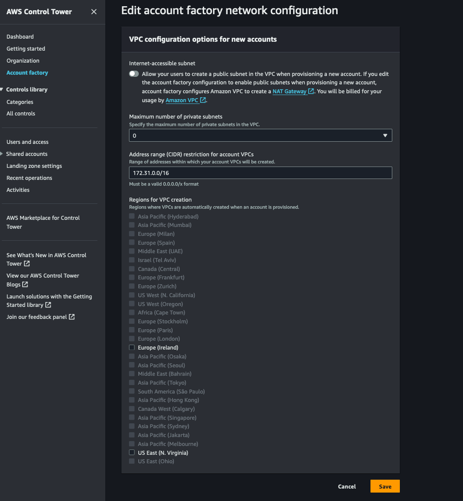
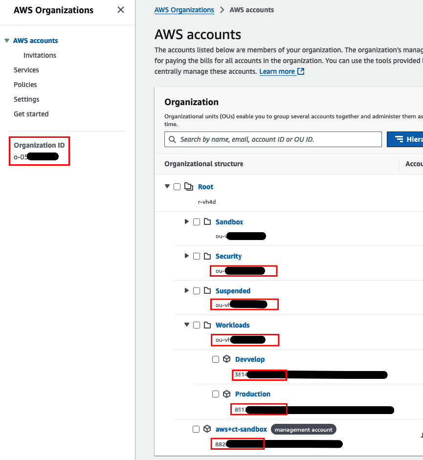

import DualCode from '../../../../components/DualCode.astro';

[AWS Control Tower](https://docs.aws.amazon.com/controltower/latest/userguide/what-is-control-tower.html) provides
a streamlined way to set up and govern a multi-account AWS environment, adhering to AWS best practices.

The Data Landing Zone (DLZ) does not manage your Control Tower configuration but requires it to be manually configured.
These resources are then passed to the Data Landing Zone CDK construct. This approach ensures DLZ can be adopted in
existing Control Tower setups or newly created (greenfield) environments.

## Prerequisites

You must have an existing AWS account that can act as or already serves as the head of the AWS Organization/Control
Tower. Alternatively, create a new Management AWS account by signing up at
[https://portal.aws.amazon.com/billing/signup](https://portal.aws.amazon.com/billing/signup).
- Use an email address not already associated with an AWS account and ensure it is accessible.
- Store the username and password securely.
- You will have to link a Credit card to the account.

This account will be referred to as the Management account.

Additional References:
- [AWS Control Tower Prerequisites](https://docs.aws.amazon.com/controltower/latest/userguide/setting-up.html)

## Enable Control Tower

1. Log in to the Management account and navigate to [Control Tower](https://console.aws.amazon.com/controltower)
1. Make a choice on what you want your `home`/`global` region is. This is the region where you CT will be deployed.
Not all [regions](https://docs.aws.amazon.com/controltower/latest/userguide/region-how.html) supports all resources.
It is recommended to use "major" region, both `eu-west-1` or `us-east-1` regions are usually good choices.
1. Choose Set up landing zone.
1. Ensure your `home` region is correct and select any other regions you want to manage and govern.
1. Select "Opt out of creating OU", we will create them manually after Control Tower is created.
1. Provide email addresses for the `Audit` and `Log Archive` accounts. These accounts will be created by Control Tower
under the `Security` OU.
1. Click **Set up landing zone**.
1. The setup process may take up to an hour, although it is often completed more quickly.

Additional References:
- [AWS Control Tower quick start guide](https://docs.aws.amazon.com/controltower/latest/userguide/quick-start.html)


## Create AWS Organization OUs

1. Log in to the Management account and navigate to [Control Tower](https://console.aws.amazon.com/controltower)
2. Select **Organizational Units** from the left-hand menu, then click **Add an OU**.
3. Ensure the following OUs are created if not already present:
    - `Workloads`
    - `Suspended`
4. Move any existing accounts into the `Workloads` OU for use with the Data Landing Zone.

:::caution
When moving AWS accounts between OUs, note that accounts will inherit the properties, such as SCPs, of the new OU
and will no longer be governed by the properties of the previous OU.
:::

## Verify IAM Identity Center

1. Log in to the Management account and navigate to [Control Tower](https://console.aws.amazon.com/controltower)
2. In the left-hand menu, navigate to **Users and Access**.
3. Verify that **IAM Identity Center** is enabled.

## Configure Account Factory

The Account Factory will be used to manually create AWS accounts for use with the Data Landing Zone.

Since VPCs will be defined by the DLZ CDK construct, Control Tower's VPC creation needs to be disabled. Follow the
[official AWS documentation](https://docs.aws.amazon.com/controltower/latest/userguide/configure-without-vpc.html)
to disable VPC creation:

1. Log in to the Management account and navigate to [Control Tower](https://console.aws.amazon.com/controltower)
2. In the Control Tower console, select **Account Factory**.
3. Edit the **Network configuration**:
    - Disable **Internet-accessible subnet**.
    - Set **Maximum number of private subnets** to 0.
    - Deselect all **Regions for VPC creation**.
4. Save your changes.



## Optionally create workload accounts

Follow the [SOP - Add Account](sop-add-account) to create new accounts or enroll existing accounts under the `Workloads` OU.

## Gather the required information for DLZ

Gather the following IDs required by the DLZ construct in the
[AWS Organisation](https://us-east-1.console.aws.amazon.com/organizations/v2/home/accounts) console:

- AWS Organisation ID
- Management account ID
- Security OU ID
- Audit Account ID
- Log Archive Account ID
- Workloads OU ID
- Any additional Account IDs that you want to use with DLZ



## Configure the DLZ CDK Construct

After gathering the required information, input the IDs into the DLZ CDK construct. Below is an example configuration
for two accounts in the `Workloads` OU. Additional accounts can be added as needed.

<DualCode>
  <Fragment slot="ts">
    ```ts
    import {App} from 'aws-cdk-lib';
    import { DataLandingZone } from 'aws-data-landing-zone';

    const app = new App();
    const dlz = new DataLandingZone(app, {
      ...
      organization: {
        organizationId: 'o-0f5h921gk9',
        root: { accounts: { management: { accountId: '123456789012', }, }, },
        ous: {
          security: {
            ouId: 'ou-hj29-dfhjj787i7',
            accounts: {
              log: { accountId: '123456789012', },
              audit: { accountId: '123456789012', },
            },
          },
          workloads: {
            ouId: 'ou-h2l0-gjr36ikn',
            accounts: [{
                name: 'development',
                accountId: '123456789012',
                type: DlzAccountType.DEVELOP,
                ...
              },{
                name: 'production',
                accountId: '123456789012',
                type: DlzAccountType.PRODUCTION,
                ...
              },

              ...AS MANY ACCOUNTS AS DESIRED...
              ]
          },
       },
       ...
     }
    });
    ```

  </Fragment>
  <Fragment slot="python">
    ```python
    import aws_cdk as cdk
    import aws_data_landing_zone as dlz

    app = cdk.App()
    dlz.DataLandingZone(app,
        ...
        organization=dlz.DLzOrganization(
            organization_id='o-0f5h921gk9',
            root=dlz.RootOptions(
                accounts=dlz.OrgRootAccounts(
                    management=dlz.DLzManagementAccount(account_id='123456789012'),
                ),
            ),
            ous=dlz.OrgOus(
                security=dlz.OrgOuSecurity(
                    ou_id='ou-hj29-dfhjj787i7',
                    accounts=dlz.OrgOuSecurityAccounts(
                        log=dlz.DLzManagementAccount(account_id='123456789012'),
                        audit=dlz.DLzManagementAccount(account_id='123456789012'),
                    ),
                ),
                workloads=dlz.OrgOuWorkloads(
                    ou_id='ou-h2l0-gjr36ikn',
                    accounts=[
                        dlz.DLzAccount(
                            name='development',
                            account_id='123456789012',
                            type=dlz.DlzAccountType.DEVELOP,
                        ),
                        dlz.DLzAccount(
                            name='production',
                            account_id='123456789012',
                            type=dlz.DlzAccountType.PRODUCTION,
                        ),

                        ...AS MANY ACCOUNTS AS DESIRED...
                    ],
                ),
            )
        ),
    )
````
  </Fragment>
</DualCode>


