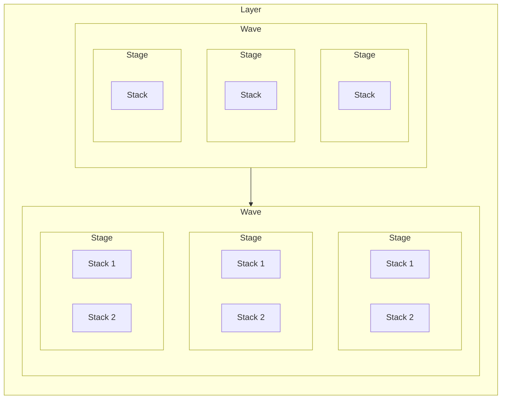

import DualCode from '../../../../components/DualCode.astro';

## Deployment Order

The [cdk-express-pipeline](https://github.com/rehanvdm/cdk-express-pipeline) is utilized to create Waves and Stages,
enabling the controlled deployment of resources. This enables deployments from any build
systems, like GitHub, GitLab, Jenkins, and even local environments.

Internally, the DLZ creates `layers`, which is a collection of `waves`. Each `layer` typically consists of a
`global` `wave` and optionally one or more `regional` `waves` which are deployed sequentially. Waves contains `stages`
which are groupings of `stacks` deployed in parallel. For the DLZ the `stage` and dependencies between `stacks` within
the same `stage` are of little importance as we rely on `waves` only.


The regions are defined in the `config`, you can only have a single Global region and optionally one or more Regions.
<DualCode>
  <Fragment slot="ts">
    ```ts
    const dlz = new DataLandingZone(app, {
      ...
      regions: {
        global: Region.EU_WEST_1,
        regional: [Region.US_EAST_1],
      },
    });
    ```
  </Fragment>
  <Fragment slot="python">
    ```python
    dlz.DataLandingZone(app,
      ...
      regions=dlz.DlzRegions(
          global_=dlz.Region.EU_WEST_1,
          regional=[dlz.Region.US_EAST_1],
          ),
      )
    ```
  </Fragment>
</DualCode>


To recap:

- `Layer` - A collection of `Waves`, this is a logical grouping only, and not implemented in code. Deployed sequentially, one after the other.
- `Wave` - A collection of `Stages`. Deployed sequentially, one after the other.
- `Stage` - A collection of `Stacks`. Deployed in parallel.
- `Stack` - A collection of ` AWS resources`. Deployed in parallel when possible as determined by stack dependencies within the `Stage`.



## General structure

Conceptually the DLZ deployment order has the following structure:

```mermaid
graph
    subgraph root["Root Layer"]
      direction TB
      subgraph rootGlobalWave["Global Wave"]
        direction TB
        subgraph rootAGlobalAccount["Root Account"]
          direction LR
          rootG["Global Stack"]
        end
      end
    end

    subgraph secOuA["Security OU - Audit Layer"]
      direction TB
      subgraph secOuAGlobal["Global Wave"]
        direction TB
        subgraph secOuAGlobalAccount["Audit Account"]
          direction LR
          secOuAG["Global Stack"]
        end
      end
%%      subgraph secOuARegional["Regional Wave"]
%%        direction TB
%%        subgraph secOuARegionalAccount["Audit Account"]
%%          direction LR
%%          secOuARn["Regional Stack (...N)"]
%%        end
%%      end
%%      secOuAGlobal --> secOuARegional
    end

%%    subgraph secOuL["Security OU - Log Layer"]
%%      direction TB
%%      subgraph secOuLGlobal["Global Wave"]
%%        direction TB
%%        subgraph secOuLGlobalAccount["Log Account"]
%%          direction LR
%%          secOuLG["Global Stack"]
%%        end
%%      end
%%      subgraph secOuLRegional["Regional Wave"]
%%        direction TB
%%        subgraph secOuLRegionalAccount["Log Account"]
%%          direction LR
%%          secOuLRn["Regional Stack (...N)"]
%%        end
%%      end
%%      secOuLGlobal --> secOuLRegional
%%    end

    subgraph base["Workload OU - Base Layer"]
      direction TB
      subgraph global["Global Wave"]
        direction TB
        subgraph globalAccountN["Account ...N"]
          direction LR
          gan["Global Stack"]
        end
         subgraph globalAccountB["Account B"]
          direction LR
          gab["Global Stack"]
        end
        subgraph globalAccountA["Account A"]
          direction LR
          gaa["Global Stack"]
        end
      end
      subgraph regional["Regional Wave"]
        direction TB
        subgraph regionalAccountN["Account ...N"]
          direction LR
          ran2["Region Stack (...N)"]
        end
        subgraph regionalAccountB["Account B"]
          direction LR
          rab2["Region Stack (...N)"]
        end
        subgraph regionalAccountA["Account A"]
          direction LR
          raa2["Region Stack (...N)"]
        end
      end
      global --> regional
    end

    subgraph ncp1["Workload OU - NCP1 Layer"]
      direction TB
      subgraph ncp1G["Global Wave"]
        direction TB
        subgraph ncp1Gan["Account ...N"]
          direction LR
          ncp1Gans["Global Stack"]
        end
         subgraph ncp1Gaa["Account B"]
          direction LR
          ncp1Gaas["Global Stack"]
        end
        subgraph ncp1Gab["Account A"]
          direction LR
          ncp1Gabs["Global Stack"]
        end
      end
%%      subgraph ncp1R["Regional Wave"]
%%        direction TB
%%        subgraph ncp1Ran["Account ...N"]
%%          direction LR
%%          ncp1Rans["Region Stack (...N)"]
%%        end
%%        subgraph ncp1Rab["Account B"]
%%          direction LR
%%          ncp1Rabs["Region Stack (...N)"]
%%        end
%%        subgraph ncp1Raa["Account A"]
%%          direction LR
%%          ncp1Raas["Region Stack (...N)"]
%%        end
%%      end
%%      ncp1G --> ncp1R
    end

    subgraph ncp2["Workload OU - NCP2 Layer"]
      direction TB
      subgraph ncp2G["Global Wave"]
        direction TB
        subgraph ncp2Gan["Account ...N"]
          direction LR
          ncp2Gans["Global Stack"]
        end
         subgraph ncp2Gaa["Account B"]
          direction LR
          ncp2Gaas["Global Stack"]
        end
        subgraph ncp2Gab["Account A"]
          direction LR
          ncp2Gabs["Global Stack"]
        end
      end

      subgraph ncp2R["Regional Wave"]
        direction TB
        subgraph ncp2Ran["Account ...N"]
          direction LR
          ncp2Rans["Region Stack (...N)"]
        end
        subgraph ncp2Rab["Account B"]
          direction LR
          ncp2Rabs["Region Stack (...N)"]
        end
        subgraph ncp2Raa["Account A"]
          direction LR
          ncp2Raas["Region Stack (...N)"]
        end
      end
      ncp2G --> ncp2R
    end

    subgraph ncp3["Workload OU - NCP3 Layer"]
      direction TB
      subgraph ncp3G["Global Wave"]
        direction TB
        subgraph ncp3Gan["Account ...N"]
          direction LR
          ncp3Gans["Global Stack"]
        end
         subgraph ncp3Gaa["Account B"]
          direction LR
          ncp3Gaas["Global Stack"]
        end
        subgraph ncp3Gab["Account A"]
          direction LR
          ncp3Gabs["Global Stack"]
        end
      end
      subgraph ncp3R["Regional Wave"]
        direction TB
        subgraph ncp3Ran["Account ...N"]
          direction LR
          ncp3Rans["Region Stack (...N)"]
        end
        subgraph ncp3Rab["Account B"]
          direction LR
          ncp3Rabs["Region Stack (...N)"]
        end
        subgraph ncp3Raa["Account A"]
          direction LR
          ncp3Raas["Region Stack (...N)"]
        end
      end
      ncp3G --> ncp3R
    end

    subgraph dsp1["Workload OU - DSP1 Layer"]
      direction TB
      subgraph dsp1G["Global Wave"]
        direction TB
        subgraph dsp1Gan["Account ...N"]
          direction LR
          dsp1Gans["Global Stack"]
        end
         subgraph dsp1Gaa["Account B"]
          direction LR
          dsp1Gaas["Global Stack"]
        end
        subgraph dsp1Gab["Account A"]
          direction LR
          dsp1Gabs["Global Stack"]
        end
      end
      subgraph dsp1R["Regional Wave"]
        direction TB
        subgraph dsp1Ran["Account ...N"]
          direction LR
          dsp1Rans["Region Stack (...N)"]
        end
        subgraph dsp1Rab["Account B"]
          direction LR
          dsp1Rabs["Region Stack (...N)"]
        end
        subgraph dsp1Raa["Account A"]
          direction LR
          dsp1Raas["Region Stack (...N)"]
        end
      end
      dsp1G --> dsp1R
    end


    root --> secOuA
    secOuA --> base
    base --> ncp1
    ncp1 --> ncp2
    ncp2 --> ncp3
    ncp3 --> dsp1
```



A brief description of the resources deployed in each layer:

- **Root Layer** - Deploys to the `root` account, resources like the Organisation's SCPs, and IAM Identity Center resources etc.
- **Security OU - Audit Layer** - Deploys to the `audit` account, resources like SecurityHub and Chatbot notifications.
- **Workload OU - Base Layer** - Deploys to each account specified under workloads. IAM roles, which is a global service, would for example be
deployed in the Global wave. While resources such as a VPCs will be deployed in both the Global and the Regional wave as per configuration.
The majority of the services are deployed in this layer.
- **Workload OU - NCP1 + NCP2 + NCP3 Layers** - NCP stands for **Network Connections Phase**, these layers are logically
numbered to indicate the order of deployment to control dependencies between accounts and regions. It will deploy
resources related to networking that require multiple steps, like VPC Peering. For example, for VPC Peering to work,
NCP1 defines the peering roles. NCP2 creates the peering connections, knowing that it can use the cross account roles
in all accounts. NCP3 creates the route table entries to allow traffic to flow between the VPCs knowing the
VPC peering connections have been established.
- **Workload OU - DSP1 Layer** - DSP is the abbreviation for **Data Services Phase**, this layer deploys resources
like Lake Formation, etc.

## Stacks

The printing of the deployment order can be controlled with the `printDeploymentOrder` flag. When set, the deployment
order will be printed as shown below. This flag is set by default.

<DualCode>
  <Fragment slot="ts">
    ```ts
    const dlz = new DataLandingZone(app, {
      ...
      printDeploymentOrder: true,
    });
    ```
  </Fragment>
  <Fragment slot="python">
  ```python
  dlz.DataLandingZone(app,
    ...
    print_deployment_order=True,
  )
  ```
  </Fragment>
</DualCode>


Given two workload accounts, `development` and `production`:

<DualCode>
  <Fragment slot="ts">
    ```ts
    const dlz = new DataLandingZone(app, {
      ...
      organization: {
        ous: {
          workloads: {
            accounts: [{
                name: 'development',
                type: DlzAccountType.DEVELOP,
                ...
              },{
                name: 'production',
                type: DlzAccountType.PRODUCTION,
                ...
              },

              ...AS MANY ACCOUNTS AS DESIRED...
              ]
          },
       },
       ...
     }
    });
    ```
  </Fragment>
  <Fragment slot="python">
  ```python
  dlz.DataLandingZone(app,
    ...
    organization=dlz.DLzOrganization(
            ous=dlz.OrgOus(
                workloads=dlz.OrgOuWorkloads(
                    accounts=[
                        dlz.DLzAccount(
                            name='development',
                            type=dlz.DlzAccountType.DEVELOP,
                        ),
                        dlz.DLzAccount(
                            name='production',
                            type=dlz.DlzAccountType.PRODUCTION,
                        ),
                    ],
                ),
            )
        ),
  )
  ```
  </Fragment>
</DualCode>

Running `cdk diff "**"` will produce the following console output:

```
> Running: cdk diff "**"

ORDER OF DEPLOYMENT
🌊 Waves  - Deployed sequentially
🔲 Stages - Deployed in parallel, all stages within a wave are deployed at the same time
📄 Stack  - Dependency driven, will be deployed after all its dependent stacks, denoted by ↳ below it, is deployed

🌊 root--global
  🔲 management
    📄 dlz-global (root--global_management_eu-west-1)
🌊 security--audit--global
  🔲 global
    📄 dlz-global (security--audit--global_global_eu-west-1)
🌊 workloads--base--global
  🔲 development--development
    📄 dlz-global (workloads--base--global_development--development_eu-west-1)
  🔲 production--production
    📄 dlz-global (workloads--base--global_production--production_eu-west-1)
🌊 workloads--base--regional
  🔲 development--development
    📄 dlz-regional (workloads--base--regional_development--development_us-east-1)
  🔲 production--production
    📄 dlz-regional (workloads--base--regional_production--production_us-east-1)
🌊 workloads--ncp1--global
  🔲 development--development
    📄 dlz-ncp1-global (workloads--ncp1--global_development--development_eu-west-1)
  🔲 production--production
    📄 dlz-ncp1-global (workloads--ncp1--global_production--production_eu-west-1)
🌊 workloads--ncp2--global
  🔲 development--development
    📄 dlz-ncp2-global (workloads--ncp2--global_development--development_eu-west-1)
  🔲 production--production
    📄 dlz-ncp2-global (workloads--ncp2--global_production--production_eu-west-1)
🌊 workloads--ncp2--regional
  🔲 development--development
    📄 dlz-ncp2-regional (workloads--ncp2--regional_development--development_us-east-1)
  🔲 production--production
    📄 dlz-ncp2-regional (workloads--ncp2--regional_production--production_us-east-1)
🌊 workloads--ncp3--global
  🔲 development--development
    📄 dlz-ncp3-global (workloads--ncp3--global_development--development_eu-west-1)
  🔲 production--production
    📄 dlz-ncp3-global (workloads--ncp3--global_production--production_eu-west-1)
🌊 workloads--ncp3--regional
  🔲 development--development
    📄 dlz-ncp3-regional (workloads--ncp3--regional_development--development_us-east-1)
  🔲 production--production
    📄 dlz-ncp3-regional (workloads--ncp3--regional_production--production_us-east-1)
🌊 workloads--dsp1--global
  🔲 development--development
    📄 dlz-dsp1-global (workloads--dsp1--global_development--development_eu-west-1)
  🔲 production--production
    📄 dlz-dsp1-global (workloads--dsp1--global_production--production_eu-west-1)
🌊 workloads--dsp1--regional
  🔲 development--development
    📄 dlz-dsp1-regional (workloads--dsp1--regional_development--development_us-east-1)
  🔲 production--production
    📄 dlz-dsp1-regional (workloads--dsp1--regional_production--production_us-east-1)
```

DLZ is only using Waves and not Stages to control dependency, so let's break this down into the "Layers" of deployment
and focus on the stacks (removing the stages) that are deployed in each layer.

Each stack is identified by the `📄` symbol, and has the following format:

```
📄 <stack-name> (<stack-id>)
```

- `<stack-name>` - The name of the stack as seen in the AWS Console
- `<stack-id>` - The unique identifier of the stack that we use to target for CDK commands like diff, deploy, destroy etc.

**Root Layer**
```
🌊 root--global
    📄 dlz-global (root--global_management_eu-west-1)
```

**Security OU - Audit Layer**
```
🌊 security--audit--global
    📄 dlz-global (security--audit--global_global_eu-west-1)
```

**Workload OU - Base Layer**
```
🌊 workloads--base--global
    📄 dlz-global (workloads--base--global_development--development_eu-west-1)
    📄 dlz-global (workloads--base--global_production--production_eu-west-1)
🌊 workloads--base--regional
    📄 dlz-regional (workloads--base--regional_development--development_us-east-1)
    📄 dlz-regional (workloads--base--regional_production--production_us-east-1)
```

**Workload OU - NCP1 Layer**
```
🌊 workloads--ncp1--global
    📄 dlz-ncp1-global (workloads--ncp1--global_development--development_eu-west-1)
    📄 dlz-ncp1-global (workloads--ncp1--global_production--production_eu-west-1)
```

**Workload OU - NCP2 Layer**
```
🌊 workloads--ncp2--global
    📄 dlz-ncp2-global (workloads--ncp2--global_development--development_eu-west-1)
    📄 dlz-ncp2-global (workloads--ncp2--global_production--production_eu-west-1)
🌊 workloads--ncp2--regional
    📄 dlz-ncp2-regional (workloads--ncp2--regional_development--development_us-east-1)
    📄 dlz-ncp2-regional (workloads--ncp2--regional_production--production_us-east-1)
```

**Workload OU - NCP3 Layer**
```
🌊 workloads--ncp3--global
    📄 dlz-ncp3-global (workloads--ncp3--global_development--development_eu-west-1)
    📄 dlz-ncp3-global (workloads--ncp3--global_production--production_eu-west-1)
🌊 workloads--ncp3--regional
    📄 dlz-ncp3-regional (workloads--ncp3--regional_development--development_us-east-1)
    📄 dlz-ncp3-regional (workloads--ncp3--regional_production--production_us-east-1)
```

**Workload OU - DSP1 Layer**
```
🌊 workloads--dsp1--global
    📄 dlz-dsp1-global (workloads--dsp1--global_development--development_eu-west-1)
    📄 dlz-dsp1-global (workloads--dsp1--global_production--production_eu-west-1)
🌊 workloads--dsp1--regional
    📄 dlz-dsp1-regional (workloads--dsp1--regional_development--development_us-east-1)
    📄 dlz-dsp1-regional (workloads--dsp1--regional_production--production_us-east-1)
```

## Stacks patterns

The DLZ uses stack IDs to enable precise targeting of specific stacks, allowing for controlled and efficient deployments.
Below are some commonly used patterns that can be applied with the CDK command:

- `**` - Target all stacks
- `root--*` - Target all stacks in the root layer
- `security--*` - Target all stacks in the security layer
- `workloads--*` - Target all workload stacks in all layers
- `workloads--base--*` - Target all workload stacks of the base layer
- `workloads--ncp*` - Target all workload stacks of all the NCP layers
- `workloads--ncp1--*` - Target all workload stacks of the NCP1 layer
- `workloads--ncp2--*` - Target all workload stacks of the NCP2 layer
- `workloads--ncp3--*` - Target all workload stacks of the NCP3 layer
- `workloads--dsp1--*` - Target all workload stacks of the DSP1 layer

Stacks can be targeted by global/regional waves as well, for example:
- `workloads--base--global_*` - Target all workload global stacks in the base layer
- `workloads--base--regional_*` - Target all workload regional stacks in the base layer

They can also be targeted by account type, for example:
- `*_*--development_*` - Target all stacks in the workload layer of type `development` (specified in the config by `type: DlzAccountType.DEVELOP`)
- `*_*--production_*` - Target all stacks in the workload layer of type `production` (specified in the config by `type: DlzAccountType.PRODUCTION`)


### Basic deployment

The basic version deploys all the stacks of the DLZ as defined by the deployment order.

```bash
cdk deploy "**"
```

### Advanced deployment

The advance deployment deploys the layers individually, allowing for manual approval steps between the deployment of
the `development` and `production` accounts in the workload OU.

```bash
cdk deploy "root--*"
cdk deploy "security--*"
cdk deploy "*_*--development_*"

**[MANUAL APPROVAL]**

cdk deploy "*_*--production_*"
```
