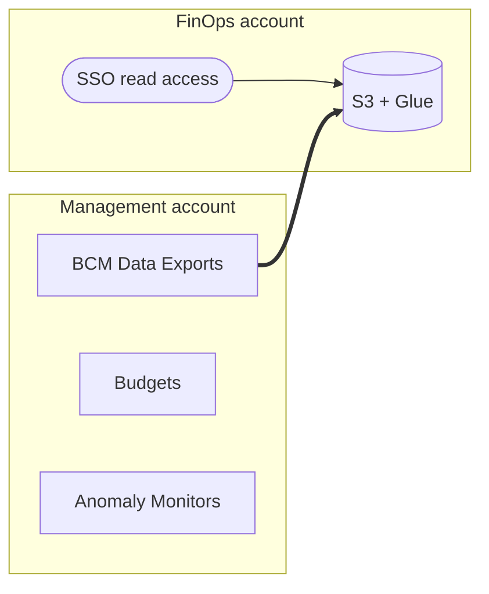

DLZ ships an opinionated FinOps capability under the top-level `finOps` prop:

| Prop | What you get |
|---|---|
| [`finOps.dataExports`](/components/finops/data-exports) | BCM Data Exports — CUR 2.0, FOCUS 1.2, Cost Optimization Recommendations, and Carbon Emissions into a dedicated FinOps account |
| [`finOps.budgets`](/components/account-management/budgets) | Org-level / tag-filtered budget alerts |
| [`finOps.accountBudgets`](/components/finops/account-budgets) | Per-account and per-cost-center budgets |
| [`finOps.costAnomalyDetection`](/components/finops/cost-anomaly-detection) | Cost Anomaly Detection monitors |
| `finOps.accountTags` | Override the FinOps stack's self-tagging defaults |

When `org.ous.sharedServices.accounts.finOps` is configured,
[`ScpFinOpsAccountBaseline`](/components/finops/finops-account-baseline) is
auto-attached to keep the account scoped to its purpose.

Mandatory tags (`Owner`, `Project`, `Environment`, `CostCenter`, `Domain`) are enforced
by tag policy + SCP and applied app-wide. `CostCenter` and `Domain` populate from
`DLzAccount.costCenter` / `DLzAccount.domain`; `finOps.dataExports` activates them as
Cost Allocation Tags automatically.

Out of scope: dashboards, chargeback, optimization recommendations. DLZ delivers raw
cost data; downstream visualization is a separate layer.

## Extras (opt-in, not deployed by DLZ)

| Extra | What it is |
|---|---|
| [CUDOS / CID dashboards](/components/finops/cudos) | AWS Cloud Intelligence Dashboards on top of the DLZ Data Exports. Documents how to deploy them and what they cost. |

## Architecture

The control plane (BCM Data Exports, Budgets, Anomaly Monitors) lives in the
management account because these are payer-only APIs. The data plane (S3 bucket
+ Glue catalog + Athena workgroup) lives in a dedicated FinOps account so
consumers (finance, eng leads, BI tools) never need management-account access.

AWS Billing writes Parquet files directly to the FinOps bucket — no DLZ-managed copy job.

## Adoption modes

| Mode | Set | What it does |
|---|---|---|
| Off | nothing | Zero footprint |
| Guardrails only | `finOps.accountBudgets`, `finOps.costAnomalyDetection` | Budgets + anomaly alerts; no FinOps account needed |
| Full | + `org.ous.sharedServices.accounts.finOps` and `finOps.dataExports` | Adds BCM Data Exports (CUR 2.0, FOCUS 1.2, Cost Opt Recs, Carbon Emissions) |

When the FinOps account is configured, [`ScpFinOpsAccountBaseline`](/components/finops/finops-account-baseline) is auto-applied
to keep the account scoped to its purpose.
