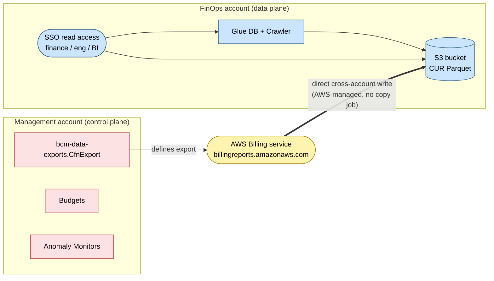

The Data Landing Zone ships an opinionated FinOps capability covering three of the four
layers from the FinOps reference model:

All capabilities are grouped under the top-level [`finOps`](#) prop on
`DataLandingZoneProps`:

- **Layer 1 — Instrumentation**: CUR 2.0 cost-data delivery via
  [`finOps.cur`](/components/finops/cur).
- **Layer 2 — Attribution**: Mandatory tags (`Owner`, `Project`, `Environment`, `CostCenter`,
  `Domain`) enforced by tag policy + SCP, applied app-wide via `Tags.of()`.
- **Layer 3 — Guardrails**: Org-wide budget alerts via `finOps.budgets`, per-account and
  per-cost-center budgets via [`finOps.accountBudgets`](/components/finops/account-budgets),
  and Cost Anomaly Detection via
  [`finOps.costAnomalyDetection`](/components/finops/cost-anomaly-detection).

Layer 4 (dashboards / chargeback / optimization recommendations) is intentionally out of
scope — DLZ delivers raw CUR data into the FinOps account and downstream visualization
belongs in a separate layer.

## Where things land

The control plane (CUR export definition, Budgets, Anomaly Detection) lives in the
**management account** because BCM Data Exports / Budgets / Cost Explorer are payer-only
APIs. The data plane (CUR S3 bucket + Glue catalog) lives in a dedicated **FinOps account**
so cost-data consumers (finance, eng leads, BI tools) never need management-account access.

There is no copy job — AWS Billing writes Parquet files directly into the FinOps-account
bucket on the export schedule.

## Adoption paths

Three coherent modes, gated by which props are set:

### 1. No FinOps

Omit everything. Zero footprint.

### 2. Guardrails only

Set `finOps.accountBudgets` and/or `finOps.costAnomalyDetection` without
`org.ous.sharedServices`. Lightweight entry point — no extra account, no S3, no Glue.
Notifications route through the existing `AccountChatbots` Slack/email infrastructure.

### 3. Full FinOps

Provision a dedicated FinOps account in AWS Organizations under a Shared Services OU,
declare it under `org.ous.sharedServices.accounts.finOps`, and set `finOps.cur` plus the
guardrail props. Cost data delivered to the dedicated account; downstream FinOps tooling
reads from there.

## Account hardening

When `org.ous.sharedServices.accounts.finOps` is set, the `ScpFinOpsAccountBaseline` SCP
is auto-attached to the FinOps account. It denies:

- Compute / data services (EC2 instances, RDS, SageMaker, Bedrock, ECS, EKS, EMR, Redshift, etc.)
- Network primitives (VPC, IGW, NAT, TGW creation)
- IAM user / access-key / login-profile creation (humans access via SSO only)
- Org-integrity actions (`LeaveOrganization`, `CloseAccount`, disabling CloudTrail / GuardDuty / Macie / Config)

Glue and Athena run on AWS-managed infrastructure, so no VPC is needed for the in-scope
use cases. Override the denied-services list with
`ScpFinOpsAccountBaseline.statements({ deniedServices: [...] })` if a deployment needs a
narrower or wider deny set.

## Mandatory tags

The DLZ already enforces five mandatory tags on every resource via tag policy, SCP, and
`Tags.of()` defaults:

| Tag | DLZ default | Purpose |
|---|---|---|
| `Owner` | `infra` | Team responsible for the resource |
| `Project` | `dlz` | Project the resource belongs to |
| `Environment` | `dlz` | dev / staging / prod |
| `CostCenter` | `dlz` | Finance cost center for chargeback |
| `Domain` | `foundation` | Data domain — foundation enforces presence; platform overlay may constrain values |

These tag keys are also activated as Cost Allocation Tags in the Billing console
(automatically by the CUR control plane) so they appear in CUR data and downstream
chargeback rolls up correctly.

## Validation

Synth-time checks fail fast with actionable messages:

- `finOps.cur` set without `org.ous.sharedServices.accounts.finOps` → synth error
- `org.ous.sharedServices.accounts.finOps` set without any FinOps capability → info log ("provisioned but dormant")
- `finOps.cur.destinationRegion` not `us-east-1` → warning (Glue + Athena must run in the same region)
- `finOps.cur.dataPlaneConfig.lifecycle.expirationDays` between 1 and 394 → synth error (minimum 395 for YoY comparisons)
- Legacy top-level `budgets` / `accountBudgets` / `costAnomalyDetection` / `cur` → synth error with migration message (move under `finOps`)
