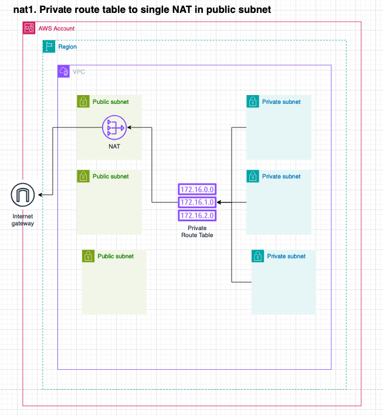

import DualCode from '../../../../components/DualCode.astro';

The Data Landing Zone offers support for creating Gateway and Instance Network Address Translators (NATs) within
a VPC. To create a NAT, specify the following parameters:

- `location`: The **Subnet** [Network Address](/reference/network-address) that defines where the NAT will be deployed.
- `allowAccessFrom`: The **Route Table** [Network Address](/reference/network-address) specifies what should route
traffic through the NAT.
- `type`: The type of NAT (Gateway or Instance), including any additional properties needed for the selected NAT type.
For example, the `instanceType` for NAT instances.

The following example configures:
- One account named `development` with two VPCs: one in the `eu-west-1` region and the other in the `us-east-1` region.
- One NAT **Gateway** in the `eu-west-1` region public subnet of the development account, routing all outbound private
subnet traffic through it.
- One NAT **Instance** in the `us-east-1` region public subnet of the development account, routing all outbound private
subnet traffic through it.

:::note
The `allowAccessFrom` Network Address must be within the same VPC. This restriction will be lifted once Transit Gateway
support is added.
:::

<DualCode>
  <Fragment slot="ts">
    ```ts {24-50}
    import {App} from 'aws-cdk-lib';
    import { DataLandingZone } from 'aws-data-landing-zone';

    const app = new App();
    const dlz = new DataLandingZone(app, {
      organization: {
        ...
        ous: {
          workloads: {
            accounts: [{
                name: 'development',
                vpcs: [
                  Defaults.vpcClassB3Private3Public(0, Region.EU_WEST_1),
                  Defaults.vpcClassB3Private3Public(1, Region.US_EAST_1),
                ],
              }
              ...
            ]
          },
       },
       ...
      },
      network: {
        nats: [
          {
            name: "development-eu-west-1-internet-access",
            location: new NetworkAddress('development', Region.EU_WEST_1, 'default', 'public', 'public-1'),
            allowAccessFrom: [
              new NetworkAddress('development', Region.EU_WEST_1, 'default', 'private')
            ],
            type: {
              gateway: {
                eip: ... //Optional
              }
            }
          },
          {
            name: 'development-us-east-1-internet-access',
            location: new NetworkAddress('development', Region.US_EAST_1, 'default', 'public', 'public-1'),
            allowAccessFrom: [
              new NetworkAddress('development', Region.US_EAST_1, 'default', 'private'),
            ],
            type: {
              instance: {
                instanceType: InstanceType.of(InstanceClass.T3, InstanceSize.MICRO),
                eip: ... //Optional
              },
            },
          },
        ]
    },
    );
    ````

  </Fragment>
  <Fragment slot="python">
    ```python {24-58}
    import aws_cdk as cdk
    import aws_data_landing_zone as dlz

    app = cdk.App()
    dlz.DataLandingZone(app,
        ...
        organization=dlz.DLzOrganization(
            ous=dlz.OrgOus(
                ...
                workloads=dlz.OrgOuWorkloads(
                    accounts=[
                        dlz.DLzAccount(
                            name='development',
                            vpcs: [
                                dlz.Defaults.vpc_class_b3_private3_public(0, dlz.Region.EU_WEST_1),
                                dlz.Defaults.vpc_class_b3_private3_public(1, dlz.Region.US_EAST_1),
                            ]
                            ...
                        ),
                    ],
                ),
            ),
            network={
                "nats": [
                    {
                        "name": "development-eu-west-1-internet-access",
                        "location": NetworkAddress(
                          "development",  str(Region.EU_WEST_1), "default", "public", "public-1",
                        ),
                        "allow_access_from": [
                            NetworkAddress(
                                "development", str(Region.EU_WEST_1), "default", "private"
                            ),
                        ],
                        "type": {
                            "instance": {
                                "instance_type": ec2.InstanceType.of(
                                    ec2.InstanceClass.T3, ec2.InstanceSize.MICRO
                                ),
                            },
                        },
                    },
                    {
                        "name": "development-us-east-1-internet-access",
                        "location": NetworkAddress(
                            "development", str(Region.US_EAST_1), "default", "public", "public-1",
                        ),
                        "allow_access_from": [
                            NetworkAddress(
                                "development", str(Region.US_EAST_1), "default", "private"
                            ),
                        ],
                        "type": {
                            "gateway": {
                            },
                        },
                    },
                ],
            }
        ),
    )
  ````
  </Fragment>
</DualCode>

Each NAT configuration includes the following:
- A single Internet Gateway
- A NAT Gateway or Instance
- Routes in the route table of the NATs pointing all outbound traffic (`0.0.0.0/0`) to the Internet Gateway
- Routes in the route table of all the `from` addresses, pointing all outbound traffic (`0.0.0.0/0`) to the NAT Gateway
or Instance.

## Configuration examples

### Single NAT Gateway in the public subnet

The default VPC includes two Route Tables, one private and one public, as defined by the `Defaults.vpcClassB3Private3Public`
function. In the configuration below, the NAT is placed in the `public-1` subnet, and the `private` route table is set to
route all outbound traffic through the NAT.

```ts
const config: DataLandingZoneProps = {
  ...configBase,
  network: {
    nats: [
      {
        name: "development-eu-west-1-internet-access",
        location: new NetworkAddress('development', Region.EU_WEST_1, 'default', 'public', 'public-1'),
        allowAccessFrom: [
          new NetworkAddress('development', Region.EU_WEST_1, 'default', 'private')
        ],
        type: {
          gateway: {}
        }
      }
    ]
  },
};
```




### NAT Gateway per AZ

Since the Default VPC function creates a single public and private route table we can not make use of it. This example
configures the VPC with separate route tables for each Availability Zone (AZ). This ensures that the NAT in each public
subnet AZ can route traffic from the private subnets within the same AZ.

This setup ensures no traffic leaves the AZ, creating a Highly Available and Resilient architecture.


<DualCode>
  <Fragment slot="ts">
    ```ts
    import {App} from 'aws-cdk-lib';
    import { DataLandingZone } from 'aws-data-landing-zone';

    const app = new App();
    const dlz = new DataLandingZone(app, {
      organization: {
        ...
        ous: {
          workloads: {
            accounts: [{
                name: 'development',
                vpcs: [
                  {
                    name: 'default',
                    region:  Region.US_EAST_1,,
                    cidr: '10.0.0.0/16',
                    routeTables: [
                      {
                        name: 'private-1',
                        subnets: [
                          {
                            name: 'private-1',
                            cidr: '10.0.0.0/19',
                            az: 'us-east-1a',
                          },
                        ],
                      },
                      {
                        name: 'private-2',
                        subnets: [
                          {
                            name: 'private-2',
                            cidr: '10.0.32.0/19',
                            az: 'us-east-1b',
                          },
                        ],
                      },
                      {
                        name: 'private-3',
                        subnets: [
                          {
                            name: 'private-3',
                            cidr: '10.0.64.0/19',
                            az: 'us-east-1b',
                          },
                        ],
                      },

                      {
                        name: 'public-1',
                        subnets: [
                          {
                            name: 'public-1',
                            cidr: '10.0.96.0/19',
                            az: 'us-east-1a',
                          },
                        ],
                      },
                      {
                        name: 'public-2',
                        subnets: [
                          {
                            name: 'public-2',
                            cidr: '10.0.128.0/19',
                            az: 'us-east-1b',
                          },
                        ],
                      },
                      {
                        name: 'public-3',
                        subnets: [
                          {
                            name: 'public-3',
                            cidr: '10.0.160.0/19',
                            az: 'us-east-1c',
                          },
                        ],
                      },
                    ],
                  },
                ],
              }
              ...
            ]
          },
       },
       ...
      },
      network: {
        nats: [
          {
            name: "development-us-east-1-internet-access-AZ-a",
            location: new NetworkAddress('development', Region.US_EAST_1, 'default', 'public', 'public-1'),
            allowAccessFrom: [
              new NetworkAddress('development', Region.US_EAST_1, 'default', 'private-1')
            ],
            type: {
              gateway: {}
            }
          },
          {
            name: "development-us-east-1-internet-access-AZ-b",
            location: new NetworkAddress('development', Region.US_EAST_1, 'default', 'public', 'public-2'),
            allowAccessFrom: [
              new NetworkAddress('development', Region.US_EAST_1, 'default', 'private-2')
            ],
            type: {
              gateway: {}
            }
          },
          {
            name: "development-us-east-1-internet-access-AZ-c",
            location: new NetworkAddress('development', Region.US_EAST_1, 'default', 'public', 'public-3'),
            allowAccessFrom: [
              new NetworkAddress('development', Region.US_EAST_1, 'default', 'private-3')
            ],
            type: {
              gateway: {}
            }
          }
        ]
      },
    );
    ```
  </Fragment>
  <Fragment slot="python">
    ```python
    import aws_cdk as cdk
    import aws_data_landing_zone as dlz

    app = cdk.App()
    dlz.DataLandingZone(app,
        ...
        organization=dlz.DLzOrganization(
            ous=dlz.OrgOus(
                ...
                workloads=dlz.OrgOuWorkloads(
                    accounts=[
                        dlz.DLzAccount(
                            name='development',
                            vpcs: [
                                {
                                    "name": "default",
                                    "region": region,
                                    "cidr": "10.0.0.0/16",
                                    "route_tables": [
                                        {
                                            "name": "private-1",
                                            "subnets": [
                                                {
                                                    "name": "private-1",
                                                    "cidr": "10.0.0.0/19",
                                                    "az": "us-east-1a",
                                                },
                                            ],
                                        },
                                        {
                                            "name": "private-2",
                                            "subnets": [
                                                {
                                                    "name": "private-2",
                                                    "cidr": "10.0.32.0/19",
                                                    "az": "us-east-1b",
                                                },
                                            ],
                                        },
                                        {
                                            "name": "private-3",
                                            "subnets": [
                                                {
                                                    "name": "private-3",
                                                    "cidr": "10.0.64.0/19",
                                                    "az": "us-east-1b",
                                                },
                                            ],
                                        },
                                        {
                                            "name": "public-1",
                                            "subnets": [
                                                {
                                                    "name": "public-1",
                                                    "cidr": "10.0.96.0/19",
                                                    "az": "us-east-1a",
                                                },
                                            ],
                                        },
                                        {
                                            "name": "public-2",
                                            "subnets": [
                                                {
                                                    "name": "public-2",
                                                    "cidr": "10.0.128.0/19",
                                                    "az": "us-east-1b",
                                                },
                                            ],
                                        },
                                        {
                                            "name": "public-3",
                                            "subnets": [
                                                {
                                                    "name": "public-3",
                                                    "cidr": "10.0.160.0/19",
                                                    "az": "us-east-1c",
                                                },
                                            ],
                                        },
                                  ],
                                }
                            ]
                            ...
                        ),
                    ],
                ),
            ),
            network={
                "nats": [
                    {
                      name: "development-us-east-1-internet-access-AZ-a",
                      location: new NetworkAddress('development', Region.US_EAST_1, 'default', 'public', 'public-1'),
                      allowAccessFrom: [
                        new NetworkAddress('development', Region.US_EAST_1, 'default', 'private-1')
                      ],
                      type: {
                        gateway: {}
                      }
                    },
                    {
                      name: "development-us-east-1-internet-access-AZ-b",
                      location: new NetworkAddress('development', Region.US_EAST_1, 'default', 'public', 'public-2'),
                      allowAccessFrom: [
                        new NetworkAddress('development', Region.US_EAST_1, 'default', 'private-2')
                      ],
                      type: {
                        gateway: {}
                      }
                    },
                    {
                      name: "development-us-east-1-internet-access-AZ-c",
                      location: new NetworkAddress('development', Region.US_EAST_1, 'default', 'public', 'public-3'),
                      allowAccessFrom: [
                        new NetworkAddress('development', Region.US_EAST_1, 'default', 'private-3')
                      ],
                      type: {
                        gateway: {}
                      }
                    }
                ],
            }
        ),
    )
  ```
  </Fragment>
</DualCode>


## API References
- [NetworkNat](https://datalandingzone.com/reference/api/#networknat)
- [NetworkNatGateway](https://datalandingzone.com/reference/api/#networknatgateway)
- [NetworkNatInstance](https://datalandingzone.com/reference/api/#networknatinstance)
