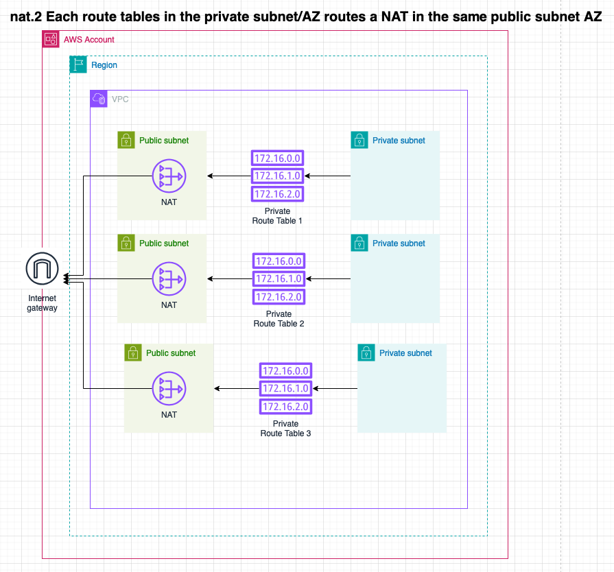

import DualCode from '../../../../components/DualCode.astro';

The Data Landing Zone provides support for creating Gateway and Instance Network Address Translators (NATs) within
a VPC. To create a NAT, specify:
- `location`: A **Subnet** [Network Address](/reference/network-address) to define where it will be deployed.
- `allowAccessFrom`: A **Route Table** [Network Address](/reference/network-address) to define what should route default traffic through it.
- `type`: The type of NAT (Gateway or Instance) and any additional properties required for the NAT type. For example,
  `instanceType` for NAT Instances.

The example below configures two NATs:
- One account called `development` with two VPCs, one in the `eu-west-1` region and the other in the `us-east-1` region.
- One NAT **Gateway** in the development account `eu-west-1` region VPC, public subnet that routes all outbound private
  subnet traffic through it.
- One NAT **Instance** in the development account `us-east-1` region VPC, public subnet that routes all outbound private
subnet traffic through it.

:::Note
The `allowAccessFrom` Network Address must be in the same VPC (this restriction will be dropped when Transit Gateway
support is added).
:::

<DualCode>
  <Fragment slot="ts">
    ```ts {24-50}
    import {App} from 'aws-cdk-lib';
    import { DataLandingZone } from 'aws-data-landing-zone';

    const app = new App();
    const dlz = new DataLandingZone(app, {
      organization: {
        ...
        ous: {
          workloads: {
            accounts: [{
                name: 'development',
                vpcs: [
                  Defaults.vpcClassB3Private3Public(0, Region.EU_WEST_1),
                  Defaults.vpcClassB3Private3Public(1, Region.US_EAST_1),
                ],
              }
              ...
            ]
          },
       },
       ...
      },
      network: {
        nats: [
          {
            name: "development-eu-west-1-internet-access",
            location: new NetworkAddress('development', Region.EU_WEST_1, 'default', 'public', 'public-1'),
            allowAccessFrom: [
              new NetworkAddress('development', Region.EU_WEST_1, 'default', 'private')
            ],
            type: {
              gateway: {
                eip: ... //Optional
              }
            }
          },
          {
            name: 'development-us-east-1-internet-access',
            location: new NetworkAddress('development', Region.US_EAST_1, 'default', 'public', 'public-1'),
            allowAccessFrom: [
              new NetworkAddress('development', Region.US_EAST_1, 'default', 'private'),
            ],
            type: {
              instance: {
                instanceType: InstanceType.of(InstanceClass.T3, InstanceSize.MICRO),
                eip: ... //Optional
              },
            },
          },
        ]
    },
    );
    ```
  </Fragment>
  <Fragment slot="python">
    ```python {24-58}
    import aws_cdk as cdk
    import aws_data_landing_zone as dlz

    app = cdk.App()
    dlz.DataLandingZone(app,
        ...
        organization=dlz.DLzOrganization(
            ous=dlz.OrgOus(
                ...
                workloads=dlz.OrgOuWorkloads(
                    accounts=[
                        dlz.DLzAccount(
                            name='development',
                            vpcs: [
                                dlz.Defaults.vpc_class_b3_private3_public(0, dlz.Region.EU_WEST_1),
                                dlz.Defaults.vpc_class_b3_private3_public(1, dlz.Region.US_EAST_1),
                            ]
                            ...
                        ),
                    ],
                ),
            ),
            network={
                "nats": [
                    {
                        "name": "development-eu-west-1-internet-access",
                        "location": NetworkAddress(
                          "development",  str(Region.EU_WEST_1), "default", "public", "public-1",
                        ),
                        "allow_access_from": [
                            NetworkAddress(
                                "development", str(Region.EU_WEST_1), "default", "private"
                            ),
                        ],
                        "type": {
                            "instance": {
                                "instance_type": ec2.InstanceType.of(
                                    ec2.InstanceClass.T3, ec2.InstanceSize.MICRO
                                ),
                            },
                        },
                    },
                    {
                        "name": "development-us-east-1-internet-access",
                        "location": NetworkAddress(
                            "development", str(Region.US_EAST_1), "default", "public", "public-1",
                        ),
                        "allow_access_from": [
                            NetworkAddress(
                                "development", str(Region.US_EAST_1), "default", "private"
                            ),
                        ],
                        "type": {
                            "gateway": {
                            },
                        },
                    },
                ],
            }
        ),
    )
  ```
  </Fragment>
</DualCode>

Each NAT configuration will define the following:
- A single Internet Gateway
- A NAT Gateway/Instance
- Routes in the route table of the NATs pointing all outbound traffic (`0.0.0.0/0`) to the Internet Gateway
- Routes in the route table of all the `from` addresses, pointing all outbound traffic (`0.0.0.0/0`) to the NAT Gateway/Instance


## Configuration examples

### Single NAT Gateway in the public subnet

The default VPC has two RouteTables according to the `Defaults.vpcClassB3Private3Public` function. A private route table
and a public route table.

In the configuration below, the NAT is placed in the `public-1` subnet and the `private` route table is configured to
route all outbound traffic to the NAT.

```ts
const config: DataLandingZoneProps = {
  ...configBase,
  network: {
    nats: [
      {
        name: "development-eu-west-1-internet-access",
        location: new NetworkAddress('development', Region.EU_WEST_1, 'default', 'public', 'public-1'),
        allowAccessFrom: [
          new NetworkAddress('development', Region.EU_WEST_1, 'default', 'private')
        ],
        type: {
          gateway: {}
        }
      }
    ]
  },
};
```


### NAT Gateway per AZ

The Default VPC function can not be used for this test as it creates a single public and private route table. Instead,
we have to manually configure the VPC to have a route table per AZ, so that we can route the private subnet traffic to
the NAT in the same public subnet AZ.

No traffic leaves the AZ, creating a Highly Available and Resilient architecture.

<DualCode>
  <Fragment slot="ts">
    ```ts
    import {App} from 'aws-cdk-lib';
    import { DataLandingZone } from 'aws-data-landing-zone';

    const app = new App();
    const dlz = new DataLandingZone(app, {
      organization: {
        ...
        ous: {
          workloads: {
            accounts: [{
                name: 'development',
                vpcs: [
                  {
                    name: 'default',
                    region:  Region.US_EAST_1,,
                    cidr: '10.0.0.0/16',
                    routeTables: [
                      {
                        name: 'private-1',
                        subnets: [
                          {
                            name: 'private-1',
                            cidr: '10.0.0.0/19',
                            az: 'us-east-1a',
                          },
                        ],
                      },
                      {
                        name: 'private-2',
                        subnets: [
                          {
                            name: 'private-2',
                            cidr: '10.0.32.0/19',
                            az: 'us-east-1b',
                          },
                        ],
                      },
                      {
                        name: 'private-3',
                        subnets: [
                          {
                            name: 'private-3',
                            cidr: '10.0.64.0/19',
                            az: 'us-east-1b',
                          },
                        ],
                      },

                      {
                        name: 'public-1',
                        subnets: [
                          {
                            name: 'public-1',
                            cidr: '10.0.96.0/19',
                            az: 'us-east-1a',
                          },
                        ],
                      },
                      {
                        name: 'public-2',
                        subnets: [
                          {
                            name: 'public-2',
                            cidr: '10.0.128.0/19',
                            az: 'us-east-1b',
                          },
                        ],
                      },
                      {
                        name: 'public-3',
                        subnets: [
                          {
                            name: 'public-3',
                            cidr: '10.0.160.0/19',
                            az: 'us-east-1c',
                          },
                        ],
                      },
                    ],
                  },
                ],
              }
              ...
            ]
          },
       },
       ...
      },
      network: {
        nats: [
          {
            name: "development-us-east-1-internet-access-AZ-a",
            location: new NetworkAddress('development', Region.US_EAST_1, 'default', 'public', 'public-1'),
            allowAccessFrom: [
              new NetworkAddress('development', Region.US_EAST_1, 'default', 'private-1')
            ],
            type: {
              gateway: {}
            }
          },
          {
            name: "development-us-east-1-internet-access-AZ-b",
            location: new NetworkAddress('development', Region.US_EAST_1, 'default', 'public', 'public-2'),
            allowAccessFrom: [
              new NetworkAddress('development', Region.US_EAST_1, 'default', 'private-2')
            ],
            type: {
              gateway: {}
            }
          },
          {
            name: "development-us-east-1-internet-access-AZ-c",
            location: new NetworkAddress('development', Region.US_EAST_1, 'default', 'public', 'public-3'),
            allowAccessFrom: [
              new NetworkAddress('development', Region.US_EAST_1, 'default', 'private-3')
            ],
            type: {
              gateway: {}
            }
          }
        ]
      },
    );
    ```
  </Fragment>
  <Fragment slot="python">
    ```python
    import aws_cdk as cdk
    import aws_data_landing_zone as dlz

    app = cdk.App()
    dlz.DataLandingZone(app,
        ...
        organization=dlz.DLzOrganization(
            ous=dlz.OrgOus(
                ...
                workloads=dlz.OrgOuWorkloads(
                    accounts=[
                        dlz.DLzAccount(
                            name='development',
                            vpcs: [
                                {
                                    "name": "default",
                                    "region": region,
                                    "cidr": "10.0.0.0/16",
                                    "route_tables": [
                                        {
                                            "name": "private-1",
                                            "subnets": [
                                                {
                                                    "name": "private-1",
                                                    "cidr": "10.0.0.0/19",
                                                    "az": "us-east-1a",
                                                },
                                            ],
                                        },
                                        {
                                            "name": "private-2",
                                            "subnets": [
                                                {
                                                    "name": "private-2",
                                                    "cidr": "10.0.32.0/19",
                                                    "az": "us-east-1b",
                                                },
                                            ],
                                        },
                                        {
                                            "name": "private-3",
                                            "subnets": [
                                                {
                                                    "name": "private-3",
                                                    "cidr": "10.0.64.0/19",
                                                    "az": "us-east-1b",
                                                },
                                            ],
                                        },
                                        {
                                            "name": "public-1",
                                            "subnets": [
                                                {
                                                    "name": "public-1",
                                                    "cidr": "10.0.96.0/19",
                                                    "az": "us-east-1a",
                                                },
                                            ],
                                        },
                                        {
                                            "name": "public-2",
                                            "subnets": [
                                                {
                                                    "name": "public-2",
                                                    "cidr": "10.0.128.0/19",
                                                    "az": "us-east-1b",
                                                },
                                            ],
                                        },
                                        {
                                            "name": "public-3",
                                            "subnets": [
                                                {
                                                    "name": "public-3",
                                                    "cidr": "10.0.160.0/19",
                                                    "az": "us-east-1c",
                                                },
                                            ],
                                        },
                                  ],
                                }
                            ]
                            ...
                        ),
                    ],
                ),
            ),
            network={
                "nats": [
                    {
                      name: "development-us-east-1-internet-access-AZ-a",
                      location: new NetworkAddress('development', Region.US_EAST_1, 'default', 'public', 'public-1'),
                      allowAccessFrom: [
                        new NetworkAddress('development', Region.US_EAST_1, 'default', 'private-1')
                      ],
                      type: {
                        gateway: {}
                      }
                    },
                    {
                      name: "development-us-east-1-internet-access-AZ-b",
                      location: new NetworkAddress('development', Region.US_EAST_1, 'default', 'public', 'public-2'),
                      allowAccessFrom: [
                        new NetworkAddress('development', Region.US_EAST_1, 'default', 'private-2')
                      ],
                      type: {
                        gateway: {}
                      }
                    },
                    {
                      name: "development-us-east-1-internet-access-AZ-c",
                      location: new NetworkAddress('development', Region.US_EAST_1, 'default', 'public', 'public-3'),
                      allowAccessFrom: [
                        new NetworkAddress('development', Region.US_EAST_1, 'default', 'private-3')
                      ],
                      type: {
                        gateway: {}
                      }
                    }
                ],
            }
        ),
    )
  ```
  </Fragment>
</DualCode>



## API References
- [NetworkNat](https://datalandingzone.com/reference/api/#networknat)
- [NetworkNatGateway](https://datalandingzone.com/reference/api/#networknatgateway)
- [NetworkNatInstance](https://datalandingzone.com/reference/api/#networknatinstance)
