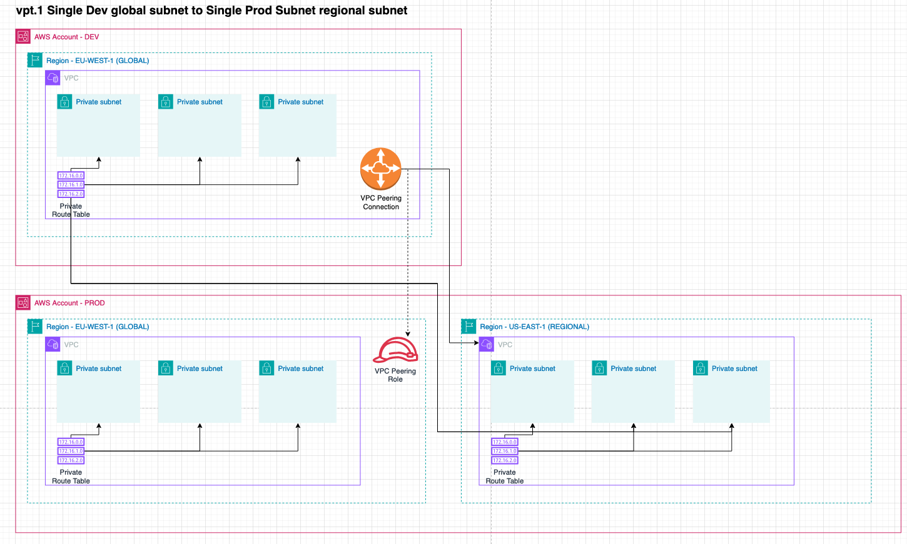
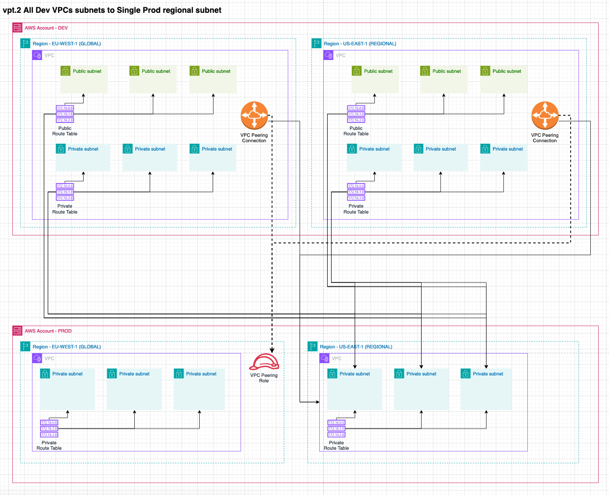
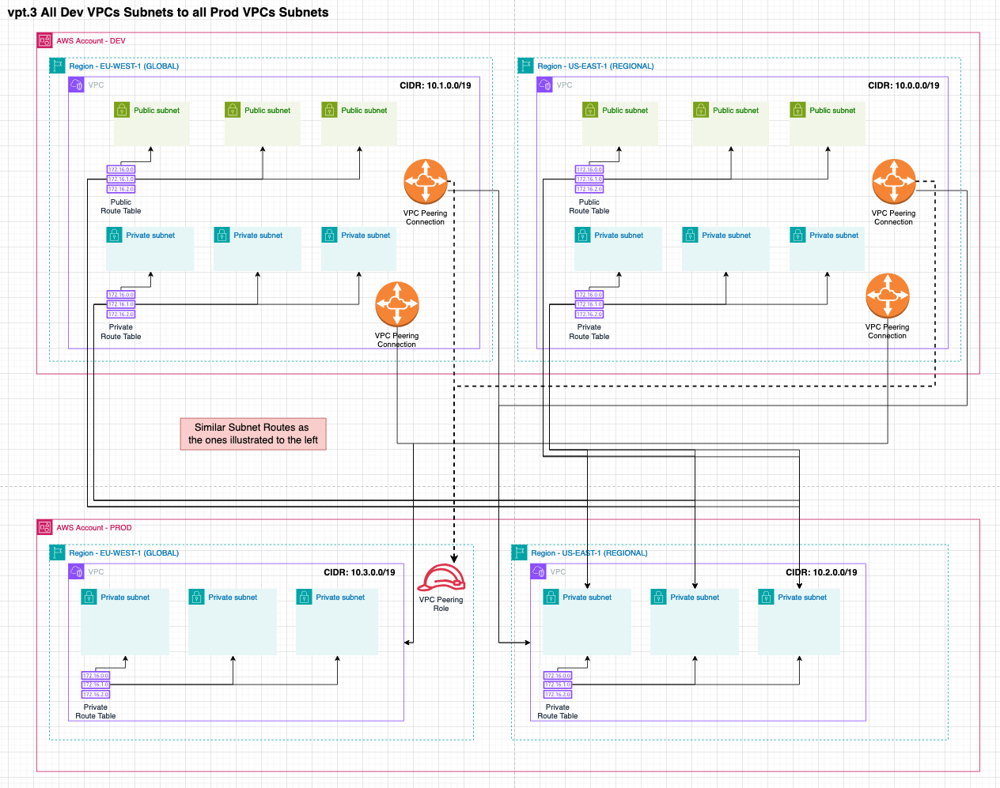

import DualCode from '../../../../components/DualCode.astro';

VPC Peering establishes a secure networking connection between two VPCs, allowing resources within them to communicate.
These VPCs can belong to the same or different accounts and regions.

To configure VPC Peering, use the `DataLandingZoneProps` object within the `network.connections.vpcPeering` property.
The configurations leverage the specific accounts and VPCs below to demonstrate various setups.

<DualCode>
  <Fragment slot="ts">
    ```ts
    import {App} from 'aws-cdk-lib';
    import { DataLandingZone } from 'aws-data-landing-zone';

    const app = new App();
    const dlz = new DataLandingZone(app, {
      organization: {
        regions: {
          global: Region.EU_WEST_1,
          regional: [Region.US_EAST_1],
        },
        ...
        ous: {
          workloads: {
            accounts: [
              {
                name: 'development',
                vpcs: [
                  Defaults.vpcClassB3Private3Public(0, Region.US_EAST_1), // CIDR 10.0.0./19
                  Defaults.vpcClassB3Private3Public(1, Region.EU_WEST_1), // CIDR 10.1.0./19
                ],
              },
              {
                name: 'production',
                vpcs: [
                  Defaults.vpcClassB3Private3Public(2, Region.US_EAST_1), // CIDR 10.2.0./19
                  Defaults.vpcClassB3Private3Public(3, Region.EU_WEST_1), // CIDR 10.3.0./19
                ],
              },
            ]
          },
       },
       ...
      },
      network: {
        connections: {
          vpcPeering: [
            ... See below configurations ...
          ],
        },
      },
    );
    ````
  </Fragment>

  <Fragment slot="python">
    ```python
    import aws_cdk as cdk
    import aws_data_landing_zone as dlz

    app = cdk.App()
    dlz.DataLandingZone(app,
        ...
        organization=dlz.DLzOrganization(
            ous=dlz.OrgOus(
                regions=dlz.DlzRegions(
                    global_=dlz.Region.EU_WEST_1,
                    regional=[dlz.Region.US_EAST_1],
                ),
                workloads=dlz.OrgOuWorkloads(
                    accounts=[
                        dlz.DLzAccount(
                            name='development',
                            vpcs: [
                                dlz.Defaults.vpc_class_b3_private3_public(0, dlz.Region.US_EAST_1), // CIDR 10.0.0./19
                                dlz.Defaults.vpc_class_b3_private3_public(1, dlz.Region.EU_WEST_1), // CIDR 10.1.0./19
                            ]
                        ),
                        dlz.DLzAccount(
                            name='production',
                            vpcs: [
                                dlz.Defaults.vpc_class_b3_private3_public(2, dlz.Region.US_EAST_1), // CIDR 10.2.0./19
                                dlz.Defaults.vpc_class_b3_private3_public(3, dlz.Region.EU_WEST_1), // CIDR 10.3.0./19
                            ]
                        ),
                    ],
                ),
            ),
            network={
                "connections": {
                    "vpc_peering": [
                        ... See below configurations ...
                    ],
                },
            }
        ),
    )
  ```
  </Fragment>
</DualCode>


## Configurations

### 1. Single route table across regions in the same account

Connects the private subnet of the development global VPC to the private subnet of the development regional VPC.

<DualCode>
  <Fragment slot="ts">
  ```ts
  ...
  network: {
    connections: {
      vpcPeering: [
        {
          source: new NetworkAddress('development', Region.EU_WEST_1, 'default', 'private'),
          destination: new NetworkAddress('development', Region.US_EAST_1, 'default', 'private'),
        },
      ],
    },
  },
  ```
  </Fragment>
  <Fragment slot="python">
  ```python
  ...
  network=dlz.Network(
      connections=dlz.NetworkConnection(
          vpc_peering=[
              dlz.NetworkConnectionVpcPeering(
                  source=dlz.NetworkAddress.from_string('development.eu-west-1.default.private'),
                  destination=dlz.NetworkAddress.from_string('development.us-east-1.default.private')
              )
          ]
      )
  ),
  ```
  </Fragment>
</DualCode>


### 2. Single route tables across accounts

Connects the private subnet of the development global VPC to the private subnet of the production regional VPC.

<DualCode>
  <Fragment slot="ts">
  ```ts
  const config: DataLandingZoneProps = {
    ...configBase,
    network: {
      connections: {
        vpcPeering: [
          {
            source: new NetworkAddress('development', Region.EU_WEST_1, 'default', 'private'),
            destination: NetworkAddress.fromString('production.us-east-1.default.private'),
          },
        ],
      },
    },
  };
  ```
  </Fragment>
  <Fragment slot="python">
  ```python
  ...
  network=dlz.Network(
      connections=dlz.NetworkConnection(
          vpc_peering=[
              dlz.NetworkConnectionVpcPeering(
                  source=dlz.NetworkAddress.from_string('development.eu-west-1.default.private'),
                  destination=dlz.NetworkAddress.from_string('production.us-east-1.default.private')
              )
          ]
      )
  ),
  ```
  </Fragment>
</DualCode>



### 3. All Dev route tables cross account with a single Pord route table

Connects all subnets of the development account in both regions to a single private subnet in the production account.

<DualCode>
  <Fragment slot="ts">
  ```ts
  const config: DataLandingZoneProps = {
    ...configBase,
    network: {
      connections: {
        vpcPeering: [
          {
            source: new NetworkAddress('development'),
            destination: NetworkAddress.fromString('production.us-east-1.default.private'),
          },
        ],
      },
    },
  };
  ```
  </Fragment>
  <Fragment slot="python">
  ```python
  ...
  network=dlz.Network(
      connections=dlz.NetworkConnection(
          vpc_peering=[
              dlz.NetworkConnectionVpcPeering(
                  source=dlz.NetworkAddress.from_string('development'),
                  destination=dlz.NetworkAddress.from_string('production.us-east-1.default.private')
              )
          ]
      )
  ),
  ```
  </Fragment>
</DualCode>



### 4. All Dev route tables cross account with all Prod route tables

Connects all subnets of the development account in both regions to all the private subnets of the production account
in both regions.

<DualCode>
  <Fragment slot="ts">
  ```ts
  const config: DataLandingZoneProps = {
    ...configBase,
    network: {
      connections: {
        vpcPeering: [
          {
            source: new NetworkAddress('development'),
            destination: NetworkAddress.fromString('production'),
          },
        ],
      },
    },
  };
  ```
  </Fragment>
  <Fragment slot="python">
  ```python
  ...
  network=dlz.Network(
      connections=dlz.NetworkConnection(
          vpc_peering=[
              dlz.NetworkConnectionVpcPeering(
                  source=dlz.NetworkAddress.from_string('development'),
                  destination=dlz.NetworkAddress.from_string('production')
              )
          ]
      )
  ),
  ```
  </Fragment>
</DualCode>




## Important considerations

- VPC Peering is a hub-spoke connection, traffic cannot leave the spoke (destination account).
- Peered VPCs can communicate bi-directionally, traffic cannot be restricted to flow in one direction. While access
can be managed using security groups, it cannot be controlled at the networking level.
- VPC Peering cannot route all traffic through a central egress account due to its hub-spoke limitation. Traffic cannot
exit the destination VPC through a NAT.
- Peering roles are not created between VPCs in the same account.
- Route table entries are limited. By default, the limit is 50, but it can be increased to 1,000 with a service quota
request.

## FAQ

### When should you use VPC Peering?

- There is no extra charges(fixed or variable) for a VPC Peering Connection.
- Data transfer between AZ, regardless of the same account or not, is free. You only pay standard EC2 data transfer
rates if data crosses AZ and Regions. This makes for cost-effective data transfer between Accounts and VPCs.
Especially for large data transfers between Accounts and VPCs in the same Region and AZ.
- You accept the hub-spoke architecture and do not require a central egress point for all traffic. In many cases,
this makes VPC Peering a better alternative to a centralized egress account with a NAT Gateway. While you can
achieve centralized routing with a Transit Gateway, it incurs additional costs, including an hourly fee for
attachments and higher data transfer rates, ~4 times more expensive than a NAT Gateway. Furthermore,
you would still need to account for the NAT Gateway's data transfer costs. For cost efficiency and reliability,
deploying individual NAT Gateways or instances in each VPC is often a superior approach. This strategy avoids a
single point of failure while maintaining cost-effectiveness.

### When should you NOT use VPC Peering?

- VPC Peering is not transitive. For example, if VPC A is peered with VPC B and VPC B is peered with VPC C, VPC A cannot
communicate with VPC C. A direct peering connection between VPC A and VPC C would be required.
- If you have many accounts needing inter-communication, the route table entry limit(1000) may become a bottleneck. For
example, connecting 10 accounts with 3 private subnets each requires 27 routes per table (9 accounts × 3 subnets),
which does not scale efficiently as the number of accounts and VPCs grows.
- If you want a central egress point for all traffic. Due to the hub-spoke architecture, traffic
cannot leave the destination VPC, except through manual proxy configurations, which are generally not recommended.


## API References
- [NetworkConnectionVpcPeering](/reference/api/#networkconnectionvpcpeering)