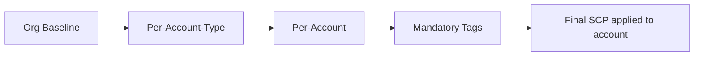

import DualCode from '../../../../components/DualCode.astro';

[Service Control Policies (SCPs)](https://docs.aws.amazon.com/organizations/latest/userguide/orgs_manage_policies_scps.html)
define the maximum permissions available to identities in member accounts. The Data Landing Zone composes SCPs from
three additive tiers and ships a library of vetted preset statements you can drop in.

## Composition model

SCPs in DLZ are composed from three tiers. All tiers are **additive only** — a tier cannot weaken or remove
statements from a tier above it.

| Tier              | Applies to                | Configured via                                          |
|-------------------|---------------------------|---------------------------------------------------------|
| Org baseline      | Every workload account    | `scpBaselineStatements`                                 |
| Per-account-type  | All accounts of one type  | `scpStatementsByAccountType.{development \| production}` |
| Per-account       | One specific account      | `DLzAccount.scpStatements`                              |

The mandatory-tags SCP is always appended after the org baseline and cannot be opted out of.



:::note
AWS Organizations limits each target to **5 attached SCPs**, with a maximum body size of **5120 bytes per policy**.
DLZ validates these limits at synthesis time and fails fast with a clear error.
:::

## SCP preset library

DLZ ships a library of preset statements covering common deny patterns. Each preset returns an
`iam.PolicyStatement` you can compose into any tier. Presets exempt the Control Tower execution role automatically
where required.

| Preset                                                | Purpose                                                                  |
|-------------------------------------------------------|--------------------------------------------------------------------------|
| `ScpDenyActionsOutsideRegions`                        | Deny regional API calls outside an allow-list (global services exempt). |
| `ScpDenyServiceActions`                               | Deny a caller-supplied list of `service:action` strings.                |
| `ScpDenyDisablingSecurityServices`                    | Block disabling GuardDuty, Macie, Security Hub, Config, CloudTrail, etc. |
| `ScpDenyLeavingOrganization`                          | Block `organizations:LeaveOrganization`.                                |
| `ScpDenyRootUserActions`                              | Block actions performed by the account root user.                       |
| `ScpDenyRootCredentialsManagementInMemberAccounts`    | Block management of root credentials in member accounts.                |
| `ScpDenyIamWithoutPermissionsBoundary`                | Require a permissions boundary on all IAM principals.                   |
| `ScpDenyS3PublicAccessBypass`                         | Block bypassing S3 Block Public Access settings.                        |
| `ScpDenyS3ObjectLockAndRetention`                     | Block tampering with S3 Object Lock and retention.                      |
| `ScpDenyBackupVaultLock`                              | Block tampering with AWS Backup Vault Lock.                             |
| `ScpDenyGlacierVaultLock`                             | Block tampering with S3 Glacier Vault Lock.                             |
| `ScpDenyMarketplaceSubscriptions`                     | Block AWS Marketplace subscription changes.                             |
| `ScpDenyDomainRegistrations`                          | Block Route53 domain registrations and transfers.                       |
| `ScpDenyDedicatedInfraAndSubscriptions`               | Block dedicated hosts, capacity reservations, and similar commitments.  |
| `ScpDenyReservedCapacityPurchases`                    | Block purchasing reserved capacity (EC2 RIs, etc.).                     |
| `ScpDenySavingsPlanPurchases`                         | Block purchasing Savings Plans.                                         |
| `ScpDenyBedrockProvisionedThroughput`                 | Block creating Bedrock Provisioned Throughput.                          |
| `ScpDenyCfnStacksWithoutStandardTags`                 | Require mandatory tags on CloudFormation stacks (always appended).      |
| `ScpDenyResourceCreationWithoutStandardTags`          | Require mandatory tags on direct resource creation (opt-in; see below).  |

## Defining a baseline

Use `scpBaselineStatements` for full control over the org baseline. Compose it from presets and your own statements.

<DualCode>
  <Fragment slot="ts">
    ```ts
    import { App } from 'aws-cdk-lib';
    import {
      DataLandingZone,
      ScpDenyActionsOutsideRegions,
      ScpDenyDisablingSecurityServices,
      ScpDenyLeavingOrganization,
      ScpDenyRootUserActions,
      ScpDenyServiceActions,
    } from 'aws-data-landing-zone';

    const app = new App();
    const dlz = new DataLandingZone(app, {
      scpBaselineStatements: [
        ScpDenyActionsOutsideRegions.statement(['eu-west-1', 'eu-central-1']),
        ScpDenyDisablingSecurityServices.statement(),
        ScpDenyLeavingOrganization.statement(),
        ScpDenyRootUserActions.statement(),
        ScpDenyServiceActions.statement(['ecs:*', 'workspaces:*']),
      ],
     ...
    });
    ```
  </Fragment>
  <Fragment slot="python">
    ```python
    import aws_cdk as cdk
    import aws_data_landing_zone as dlz

    app = cdk.App()
    dlz.DataLandingZone(app,
        scp_baseline_statements=[
            dlz.ScpDenyActionsOutsideRegions.statement(["eu-west-1", "eu-central-1"]),
            dlz.ScpDenyDisablingSecurityServices.statement(),
            dlz.ScpDenyLeavingOrganization.statement(),
            dlz.ScpDenyRootUserActions.statement(),
            dlz.ScpDenyServiceActions.statement(["ecs:*", "workspaces:*"]),
        ],
        ...
    )
    ```
  </Fragment>
</DualCode>

## Layering by account type

Apply additional restrictions to all accounts of one type via `scpStatementsByAccountType`. For example, prevent
production accounts from purchasing long-term commitments while leaving development accounts unrestricted:

<DualCode>
  <Fragment slot="ts">
    ```ts
    import {
      DataLandingZone,
      ScpDenyReservedCapacityPurchases,
      ScpDenySavingsPlanPurchases,
    } from 'aws-data-landing-zone';

    const dlz = new DataLandingZone(app, {
      scpStatementsByAccountType: {
        production: [
          ScpDenyReservedCapacityPurchases.statement(),
          ScpDenySavingsPlanPurchases.statement(),
        ],
      },
     ...
    });
    ```
  </Fragment>
  <Fragment slot="python">
    ```python
    dlz.DataLandingZone(app,
        scp_statements_by_account_type={
            "production": [
                dlz.ScpDenyReservedCapacityPurchases.statement(),
                dlz.ScpDenySavingsPlanPurchases.statement(),
            ],
        },
        ...
    )
    ```
  </Fragment>
</DualCode>

## Per-account extras

Use `scpStatements` on a `DLzAccount` for one-off restrictions that only apply to a single account.

<DualCode>
  <Fragment slot="ts">
    ```ts
    import * as iam from 'aws-cdk-lib/aws-iam';

    const dlz = new DataLandingZone(app, {
      organization: {
        ous: {
          workloads: {
            accounts: [
              {
                name: 'data-prod',
                type: DlzAccountType.PRODUCTION,
                scpStatements: [
                  new iam.PolicyStatement({
                    sid: 'DenyDynamoDBDelete',
                    effect: iam.Effect.DENY,
                    actions: ['dynamodb:DeleteTable'],
                    resources: ['*'],
                  }),
                ],
                ...
              },
            ],
          },
          ...
        },
        ...
      },
     ...
    });
    ```
  </Fragment>
  <Fragment slot="python">
    ```python
    from aws_cdk import aws_iam as iam

    dlz.DataLandingZone(app,
        organization=dlz.DLzOrganization(
            ous=dlz.OrgOus(
                workloads=dlz.OrgOuWorkloads(
                    accounts=[
                        dlz.DLzAccount(
                            name="data-prod",
                            type=dlz.DlzAccountType.PRODUCTION,
                            scp_statements=[
                                iam.PolicyStatement(
                                    sid="DenyDynamoDBDelete",
                                    effect=iam.Effect.DENY,
                                    actions=["dynamodb:DeleteTable"],
                                    resources=["*"],
                                ),
                            ],
                            ...
                        ),
                    ],
                ),
                ...
            ),
            ...
        ),
        ...
    )
    ```
  </Fragment>
</DualCode>

## Enforcing mandatory tags on resource creation

`mandatoryTags` has three enforcement layers, and none is a blanket "every resource must be tagged" gate:

- **Tag policy.** Enforces allowed *values* on tagging operations for supported services. It cannot require a tag to be *present* at creation, so an untagged resource is still allowed.
- **`ScpDenyCfnStacksWithoutStandardTags`.** Hard-denies, but only `cloudformation:CreateStack`. Resources created directly via console, CLI, or SDK never hit `CreateStack`, so they bypass it.
- **AWS Config `REQUIRED_TAGS` rule.** Detective only. It flags non-compliant resources after the fact.

To make tag presence a hard stop on direct resource creation, add the opt-in `ScpDenyResourceCreationWithoutStandardTags` preset. It emits one `Deny` per tag key (so a single missing tag blocks the request) over a list of create actions you supply, and it exempts the Control Tower execution role.

It is **not** part of the baseline. You add it deliberately, because it takes three conscious choices:

- **Which actions to gate.** Only include create actions that support `aws:RequestTag` at creation. An action that cannot carry request tags would have the tag permanently absent and be denied outright. `iam:CreateGroup` is one such case (its reference row lists no tag condition keys), which is why it is excluded from the IAM set below. The preset ships four ready-made action sets (in the table below), each verified against the [AWS Service Authorization Reference](https://docs.aws.amazon.com/service-authorization/latest/reference/reference_policies_actions-resources-contextkeys.html). Verify anything you add the same way.
- **Body size.** The rendered policy grows with `actions` × `tagKeys`. DLZ packs the entire baseline + account-type + per-account tier into a **single** SCP per account and validates that one body against the 5120-byte limit at synth (see [Validation](#validation)); it does not auto-split. Each action set fits its own SCP, but two large sets in one account will overflow, so plan to pick one or split across account tiers.
- **Value enforcement stays with the tag policy.** This preset checks presence only.

The preset exposes four verified action sets (each a `public static readonly string[]`). Spread the ones you want into `statements()`:

| Action set | Covers | Approx. SCP body (×5 tag keys) |
|---|---|---|
| `CORE_TAG_ON_CREATE_ACTIONS` | Core compute/data (EC2, RDS, DynamoDB, Lambda, EKS/ECS, SQS/SNS, KMS, Secrets Manager, ELB, Redshift) | ~2.8 KB |
| `DATA_PLATFORM_TAG_ON_CREATE_ACTIONS` | Analytics/ML (Glue, Athena, EMR, Firehose, MSK, OpenSearch `es:CreateDomain`, Redshift Serverless, Step Functions, SageMaker, Bedrock) | ~4.1 KB |
| `INFRA_TAG_ON_CREATE_ACTIONS` | Networking/storage/compute (CloudWatch Logs, ECR, EFS, ElastiCache, Auto Scaling, extra EC2, EKS node groups, RDS sub-resources) | ~3.8 KB |
| `IAM_TAG_ON_CREATE_ACTIONS` | `iam:CreateUser`, `iam:CreateRole`, `iam:CreatePolicy` (excludes `iam:CreateGroup`, which has no tag support) | ~1.4 KB |

<DualCode>
  <Fragment slot="ts">
    ```ts
    import {
      DataLandingZone,
      ScpDenyResourceCreationWithoutStandardTags,
    } from 'aws-data-landing-zone';

    const Preset = ScpDenyResourceCreationWithoutStandardTags;
    const dlz = new DataLandingZone(app, {
      scpBaselineStatements: [
        ...Preset.statements([
          ...Preset.CORE_TAG_ON_CREATE_ACTIONS,
          ...Preset.IAM_TAG_ON_CREATE_ACTIONS,
        ]),
      ],
     ...
    });
    ```
  </Fragment>
  <Fragment slot="python">
    ```python
    import aws_data_landing_zone as dlz

    preset = dlz.ScpDenyResourceCreationWithoutStandardTags
    dlz.DataLandingZone(app,
        scp_baseline_statements=[
            *preset.statements([
                *preset.CORE_TAG_ON_CREATE_ACTIONS,
                *preset.IAM_TAG_ON_CREATE_ACTIONS,
            ]),
        ],
        ...
    )
    ```
  </Fragment>
</DualCode>

By default it requires the five canonical mandatory tag keys (`Owner`, `Project`, `Environment`, `CostCenter`, `Domain`). Pass a second argument to require a different set, e.g. when you also gate `additionalMandatoryTags`.

## Validation

DLZ validates each account's resolved SCP at synthesis time and fails with a clear error if:

- the resolved policy is empty (AWS rejects empty policies)
- more than 5 SCPs would be attached to the account
- the policy body exceeds 5120 bytes

This catches misconfiguration before any CloudFormation deployment runs.

## API References
- [DataLandingZoneProps.scpBaselineStatements](/reference/api/#aws-data-landing-zone.DataLandingZoneProps.property.scpBaselineStatements)
- [DataLandingZoneProps.scpStatementsByAccountType](/reference/api/#aws-data-landing-zone.DataLandingZoneProps.property.scpStatementsByAccountType)
- [DLzAccount.scpStatements](/reference/api/#aws-data-landing-zone.DLzAccount.property.scpStatements)
- [ScpStatementsByAccountType](/reference/api/#aws-data-landing-zone.ScpStatementsByAccountType)
