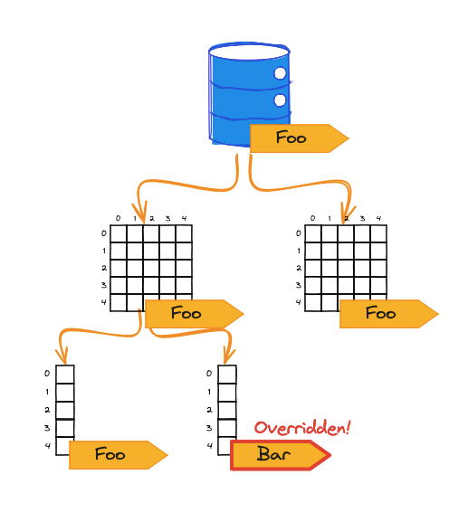
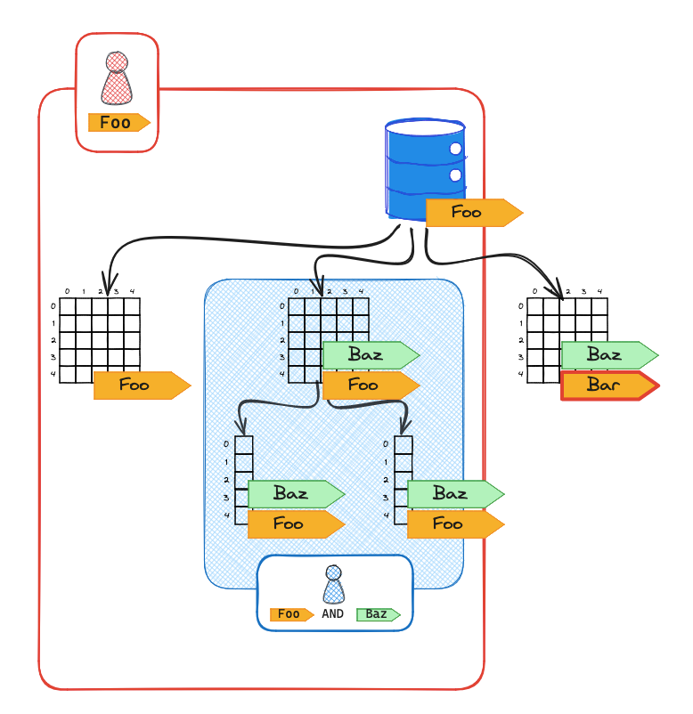

import DualCode from '../../../components/DualCode.astro';


We recommend adopting a Tag-Based Access Control (TBAC) strategy in Lake Formation, which is the default
behavior when the `hybridMode` flag is set to `false`, disabling IAM management.

Rather than directly assigning permissions to individual resources, this approach uses tags on resources,
and permissions are granted based on those tags to principals. This strategy simplifies data governance by significantly
reducing the effort required to set up and manage permissions, especially in large environments.

Here is a summary of the key concepts involved in Tag-Based Access Control (TBAC):

- **LF-Tags**: Key-value pairs that are attached to resources.
- **Resources**: These include databases, tables, and columns registered in Lake Formation.
- **Principals**: IAM entities (Users, Roles, AWS SSO, SAML), AWS accounts, Organizations, and Organizational Units.
- **Grants**: Permissions given to principals for accessing resources based on their LF-tags.

## Tag-Based Access Control (TBAC)

Grants in TBAC are typically expressed as SQL statements, but here they are provided in pseudocode for easy
conceptualization. These grants ultimately translate into CloudFormation/CDK constructs. We will reason about
permissions in this Grant format.

A typical Grant expression might look like this:

```sql
GRANT ACCESS ON TAGS foo=bar AND spam=eggs TO DataLakeUser
```

### Rules

LF-Tags follow a set of fundamental rules:

- Tags are assigned to data catalog resources (databases, tables and columns), and each resource can
have multiple tags, with a maximum of **50 tags** and **no duplicate keys**.
- Grants are applied **TO** principals **ON** specific tags. For example:

  ```sql
  GRANT ACCESS ON TAGS foo=bar TO user
    ```

- In a grant expression, all tag **keys** are evaluated using `AND` logic, while tag **values** are
evaluated using `OR` logic. For instance:


  The user has access to resources tagged with both `foo=bar` AND `spam=eggs`
  ```sql
  GRANT ACCESS ON TAGS foo=bar AND spam=eggs TO user
  ```

  The user has access to resources tagged with either `foo=bar` OR `foo=baz`
  ```sql
  GRANT ACCESS ON TAGS foo=['bar', 'baz'] TO user
  ```
- Tags assigned to resources are **inherited**, unless specifically overridden.

  
- Grants ensure access to resources where **ALL** conditions specified are true.

  


### Limitations

There are a few limitations in designing flexible tag systems:

- A resource cannot have the same LF-tag key more than once. For example, you cannot apply both
`team=sales` and `team=marketing` to the same table.

  One workaround is to embed the name inside the tag key, making the tag behave as a toggle, such as
  `team:sales=true` and `team:marketing=true`.

- A `GRANT` statement cannot use an `OR` condition across different tag keys. The following statement is
**invalid**:

  ❌ Invalid
  ```sql
  GRANT ACCESS ON TAGS foo=bar OR spam=eggs TO user
  ```

  ✅ Valid
  ```sql
  GRANT ACCESS ON TAGS foo=bar TO user
  GRANT ACCESS ON TAGS spam=eggs TO user
  ```


### Best Practices

Here are some best practices and recommendations to consider when designing your tagging system:

- LF-Tags are hierarchical. If you apply a `GRANT` statement to a high-level resource (like a database),
this inherently grants access to all child resources (like a table) that share the same tag value.

- When creating a `GRANT` statement, remember that tags are **AND-ed**, not **OR-ed**. For example:

  ```sql
  GRANT ACCESS ON TAGS team:marketing=true TO executives
  ```

  This grants the `executives` group access to all resources tagged with `team:marketing=true`.

  If the statement is modified to:

  ```sql
  GRANT ACCESS ON TAGS team:marketing=true AND PII=true TO executives
  ```

  The `executives` group is granted access only to resources that are tagged with both `team:marketing=true`
  and `PII=true`.

## Tag Strategy

There is no one-size-fits-all solution; the most effective strategy is the one that aligns best with an
organization's structure. The recommended strategy is a modified version of the
[AWS Recommended Common LF-Tag Ontologies](https://aws.github.io/aws-lakeformation-best-practices/lf-tags/common-ontologies/).

Below are some suggested LF-tagging conventions:

- `product:<product_name> = true`: Apply this tag to resources that belong to a specific product.
- `team:<team_name> = true`: Apply this tag to resources belonging to a specific team.
- `sensitive = [true, false]`: For resources containing sensitive data, such as Personally Identifiable
Information (PII).
- `sharable = [true, false]`: For resources that can be shared with other teams.

## Roles and Grants

We recommend defining roles in a structure similar to the one below:

- `AdminTeamRole`: For users with executive or administrative responsibilities.
- `<team_name>TeamRole`: For users belonging to specific teams, e.g., `SalesTeamRole`.

The following grants can serve as defaults or a baseline, which can be expanded upon as more specific
needs arise.

- Admins have access to every resource:
  ```sql
  GRANT READ ACCESS ON TAGS team:Admins=true
  ```

- Everyone has access to resources tagged as sharable.
  ```sql
  GRANT READ ACCESS ON TAGS sharable=true
  ```

- Teams have access to resources tagged with their team's name, but only those not flagged as sensitive. They are the
  only ones that have write access to their resources.
  ```sql
  GRANT FULL ACCESS ON TAGS team:<team_name>=true AND sensitive=false
  ```

## Other Sources
- https://aws.github.io/aws-lakeformation-best-practices/
- https://docs.aws.amazon.com/lake-formation/latest/dg/lf-tag-considerations.html