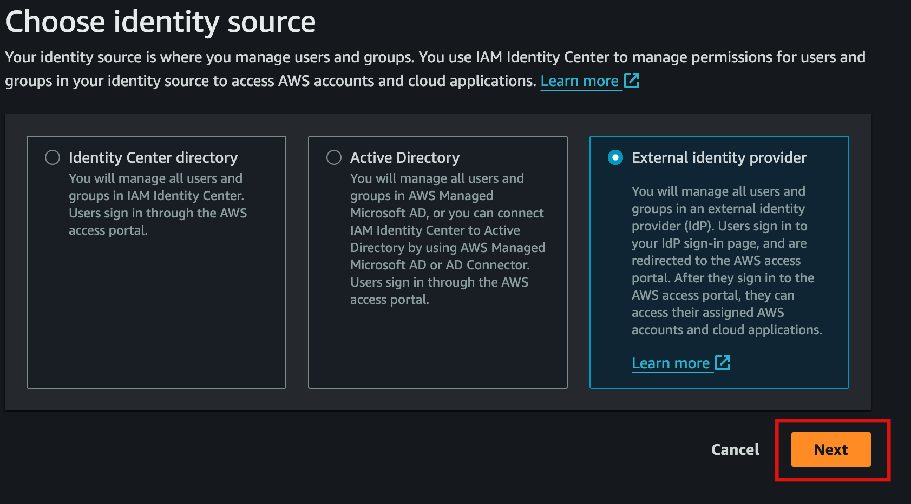
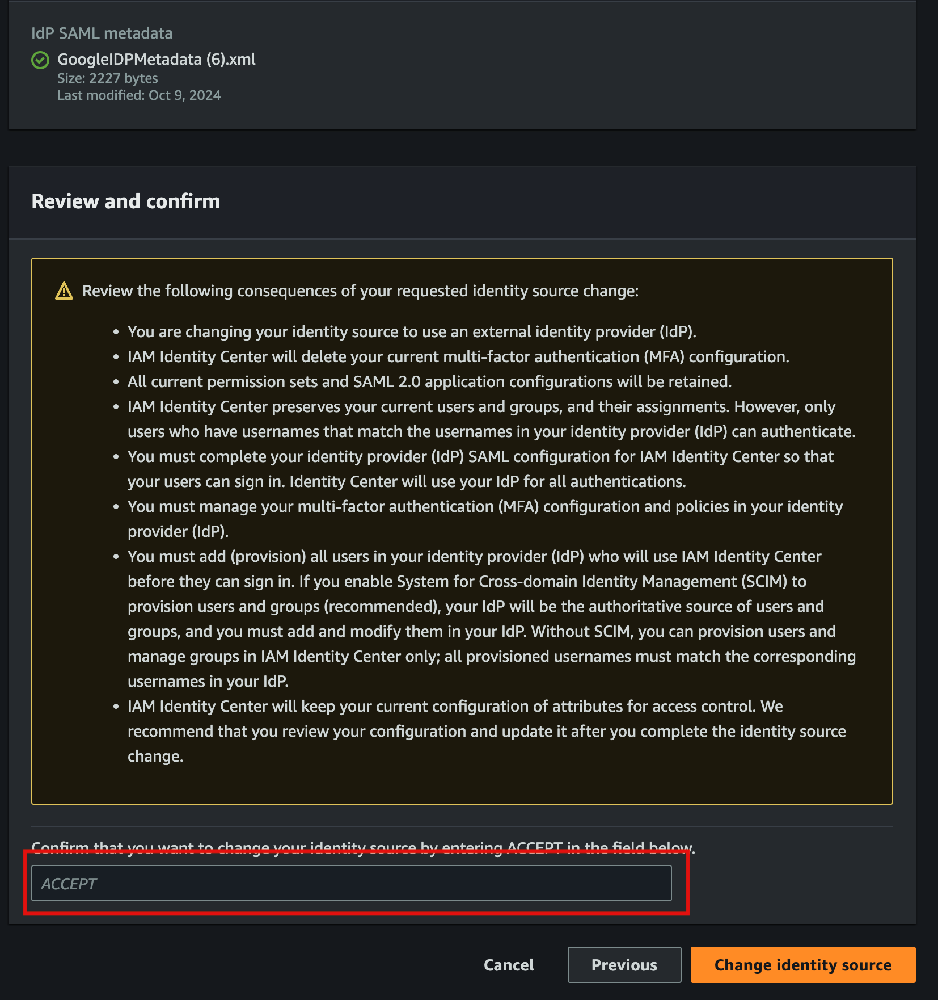

*AWS IAM Identity Center* (formerly AWS Single Sign-On) allows centralized management of access to multiple AWS accounts
and applications. This guide outlines the step-by-step process to configure IAM Identity Center with external identity
providers (IdPs) for managing users in your AWS environment.

For comprehensive instructions, refer to the AWS documentation on [IAM Identity Center Identity Source](https://docs.aws.amazon.com/singlesignon/latest/userguide/tutorials.html).

:::note
Disable automatic provisioning and map the IdP Email attribute to the IAM Identity Center Email attribute.
:::

## Enable IAM Identity Center
1. Log in to the **Management** account, which serves as the root account for the organization and the AWS Control Tower
account.
2. Ensure you are in the home/global region specified in your Control Tower setup.
3. Navigate to the **IAM Identity Center** service.
4. If accessing IAM Identity Center for the first time, you will be prompted to enable it.
5. Click **Enable IAM Identity Center**, choose "Enable with AWS Organizations," and click **Continue**.

6. Select **External identity provider** as your identity source.

7. Configure a SAML application in your IdP. Refer to the IdP documentation for guidance. For example, Google provides
[this guide](https://support.google.com/a/answer/6087519?hl=en#zippy=%2Cstep-add-the-custom-saml-app). Follow the
steps specific to your IdP and copy the IAM Identity Center Service Provider metadata into the IdP configuration.

8. Once the IdP steps are complete, download the IdP SAML metadata file and upload it to IAM Identity Center. Click
**Next**.
9. If switching identity sources, a warning will appear. Carefully review it and consult external resources to understand
the implications of changing the identity source.

10. Turn off automatic provisioning, as users will be defined through the DLZ.

11. Create a Trusted Token Issuer by navigating to the **Authentication** section in the settings page. Click
**Create Trusted Token Issuer**.

12. Complete the Trusted Token Issuer fields based on your IdP:
- Provide a name, such as `google`.
- Enter the Trusted Token Issuer URL, e.g., `https://accounts.google.com/`.
- Map the IdP **Email (email)** attribute to the **Email** attribute in IAM Identity Center. Mapping email is crucial
for using it as the username and matching users with the IdP.

