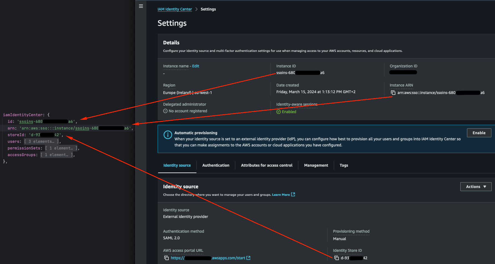

This Standard Operating Procedure (SOP) provides guidance on setting up IAM Identity Center (formerly AWS Single
Sign-On) and integrating it with the Data Landing Zone (DLZ) to manage users, permissions, and roles.

AWS IAM Identity Center simplifies access management by providing centralized user sign-in and permissions for AWS
accounts and applications. It integrates with external Identity Providers (IdPs) or the internal Identity Center
directory to manage user authentication and assign access permissions in a unified manner.

## Enable IAM Identity Center

Choose one of the following options based on your requirements:

### Use Internal Directory (AWS IAM Identity Center Directory)

Refer to the [SOP - IAM Identity Center Internal Directory](iam-identity-center-setup-internal) for detailed instructions.

Select the Internal Directory when:
- Users are managed natively within AWS IAM Identity Center without external dependencies.
- User creation, management, and authentication occur entirely within the AWS environment.
- This option is suitable for simpler setups or environments without an external IdP.
- It allows direct management of users and groups within AWS.

### Use External Identity Provider

Refer to the [SOP - IAM Identity Center External Identity Provider](iam-identity-center-setup-external) for detailed
instructions.

Select an External Identity Provider when:
- You need to integrate an existing external IdP, such as Google Workspace, Microsoft Azure AD, or Okta.
- Users authenticate through the external IdP, with AWS IAM Identity Center federating their access based on AWS-defined
permissions.
- This option is ideal for organizations already managing users with an external IdP to centralize identity management.
- It supports authentication standards like SAML 2.0 or OIDC.

## Configure the DLZ Construct to Use IAM Identity Center

Retrieve the required settings from the IAM Identity Center dashboard and configure them in the DLZ construct.

