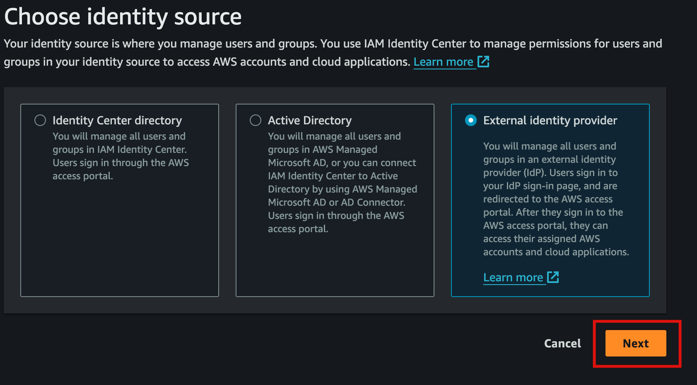
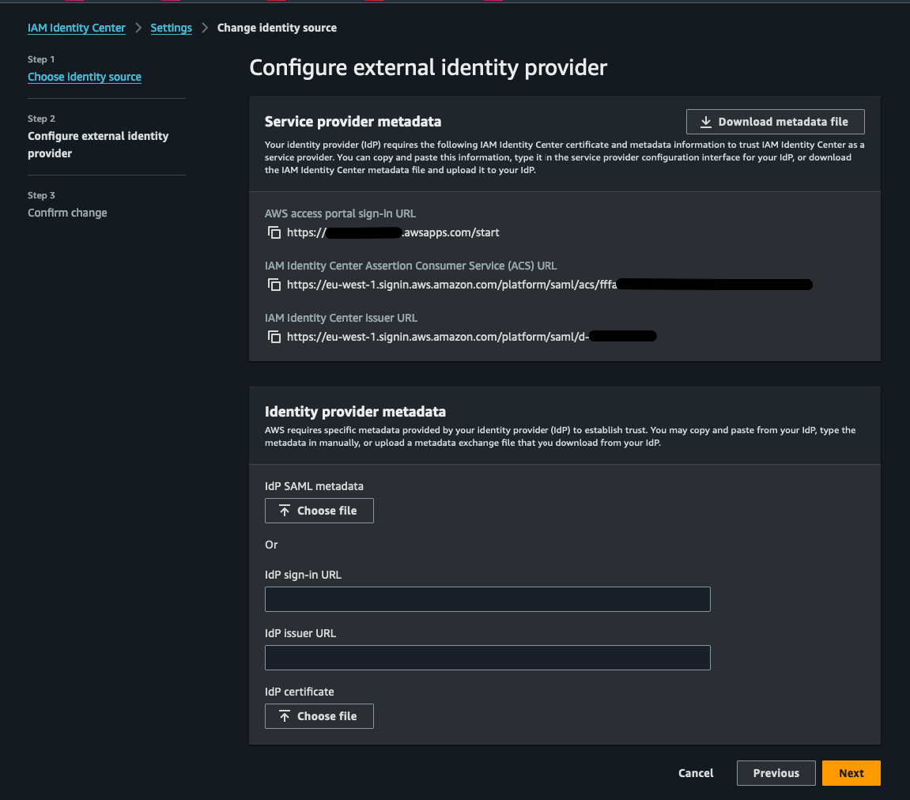
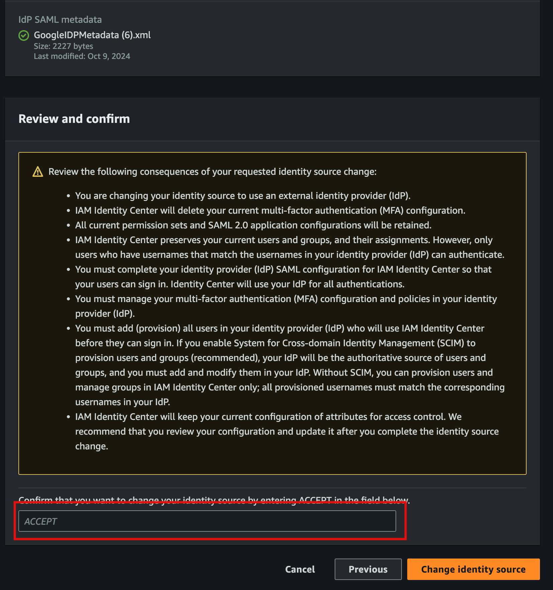
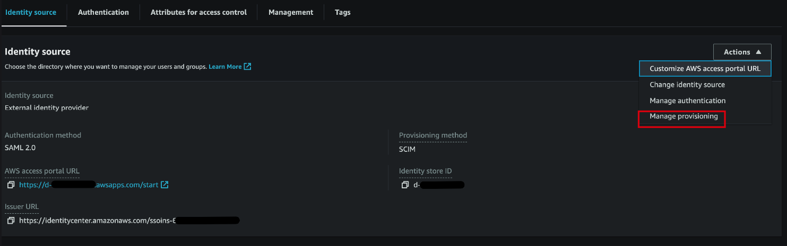
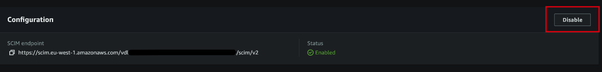
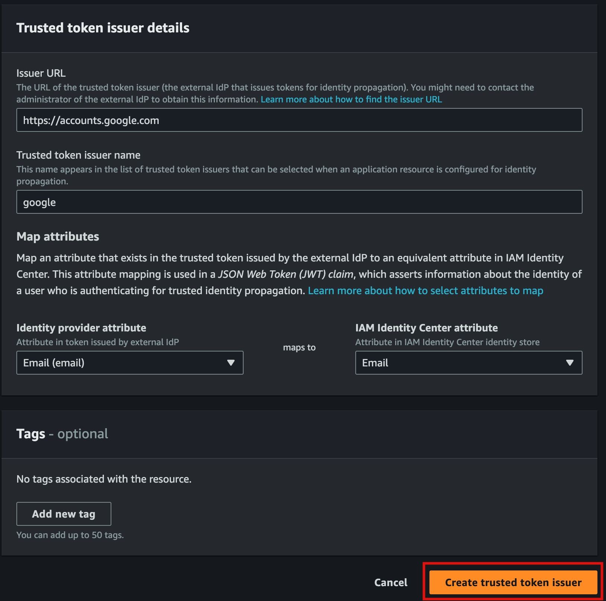

*AWS IAM Identity Center* (formerly known as AWS Single Sign-On) allows you to centrally manage access to multiple AWS
accounts and applications. This guide provides a detailed, step-by-step process to set up IAM Identity Center -
external Identity Providers (IdPs) to manage users in your AWS environment.

For detailed instructions, see the AWS documentation on [IAM Identity Center Identity source](https://docs.aws.amazon.com/singlesignon/latest/userguide/tutorials.html).

:::note
Make sure to disable automatic provisioning and map the IdP Email attribute to the IAM Identity Center Email attribute.
This allows us to manage users in the DLZ by setting their `username` to their email address.
:::

## Enable IAM Identity Center
1. Log in to the **Management** account, the same account that is the root account for the organization and the AWS
Control Tower account.
1. Ensure you are in the home/global region according to your Control Tower setup.
1. Navigate to the **IAM Identity Center** service,
1. If this is your first time accessing IAM Identity Center, you will be prompted to enable it.
1. Click on the **Enable IAM Identity Center** button, select "Enable with AWS Organizations" and click **Continue**.
  
1. Select **External identity provider** as your identity source.
  
1. Configure a SAML application in your IdP. This can be found on the IdP site, for example, if integrating with Google,
they provide [this guide](https://support.google.com/a/answer/6087519?hl=en#zippy=%2Cstep-add-the-custom-saml-app).
Each IdP will have different steps to follow, see the link at the top of the page for more information. Copy the
IAM Identity Center Service provider metadata into the IdP configuration.
  
1. Then after completing the steps on th IdP, download the IdP SAML metadata file and upload it to IAM Identity Center
as seen above, then click **Next**.
1. If you are changing Identity sources, you will get a warning like below, carefully read the warning and read
external resources to what will happen when you change the identity source.
  
1. For this guide, we will turn automatic provisioning off as we will define users code with the DLZ.
  
  
1. Create a Trusted Token Issuer. Navigate to the **Authentication** section from the settings page, click on
select **Create trusted token Issuer**
  
1. Complete the fields, according to your IdP.
  - Give the issuer a name, in our case, `google`.
  - Enter the trusted token Issuer URL, in our case `https://accounts.google.com/`.
  - Make sure to map the IdP **Email (email)** attribute to the **Email** IAM Identity Center attribute. This is
    important as email is used as the username in IAM Identity Center and to match the user on the IdP.
  
