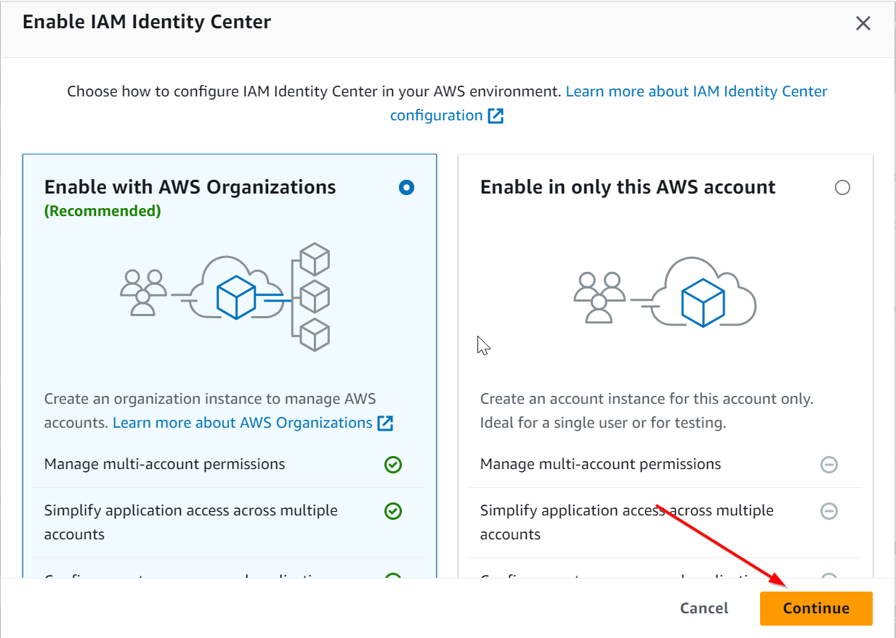

*AWS IAM Identity Center* (formerly known as AWS Single Sign-On) allows you to centrally manage access to multiple AWS
accounts and applications. This guide provides a detailed, step-by-step process to set up IAM Identity Center -
Identity Center directory to manage users in your AWS environment.

For detailed instructions, see the AWS documentation on [IAM Identity Center Identity source](https://docs.aws.amazon.com/singlesignon/latest/userguide/tutorials.html).

## Enable IAM Identity Center
1. Log in to the **Management** account, the same account that is the root account for the organization and the AWS
Control Tower account.
1. Ensure you are in the home/global region according to your Control Tower setup.
1. Navigate to the **IAM Identity Center** service,
1. If this is your first time accessing IAM Identity Center, you will be prompted to enable it.
1. Click on the **Enable IAM Identity Center** button, select "Enable with AWS Organizations" and click **Continue**.
  
1. Select **Identity Center directory** as your identity source.
  
1. Click **Next** and complete any additional steps as required.