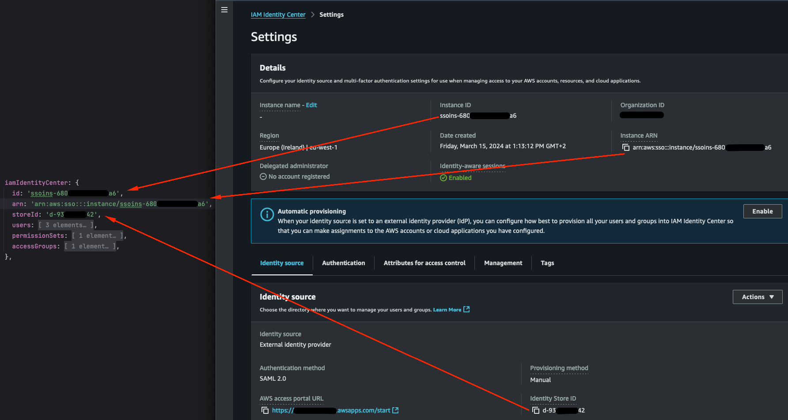

This Standard Operating Procedure (SOP) provides a guide on setting up your IAM Identity Center(formerly known as
AWS Single Sign-On) and then integrate it with the Data Landing Zone (DLZ) to manage users, permissions, and roles.

AWS IAM Identity Center is a service that simplifies access management by enabling
centralized user sign-in and permissions for AWS accounts and applications. It integrates with external Identity
Providers (IdPs) or the internal Identity Center directory to manage users, their authentication and provides a
unified way to assign and enforce access permissions.

## Enable IAM Identity Center

Choose one of the following options to set up IAM Identity Center based on your requirements:

#### Use Internal Directory (AWS IAM Identity Center Directory)

See the [SOP - IAM Identity Center Internal Directory](iam-identity-center-setup-internal) for detailed steps.

Choose the Internal Directory when:
- Manages users natively within AWS IAM Identity Center without external dependencies.
- Users are created, managed, and authenticated within the AWS environment.
- Suitable for simpler setups or where no external IdP is in place.
- Allows for direct user and group management within AWS.

#### Use External Identity Provider

See the [SOP - IAM Identity Center External Identity Provider](iam-identity-center-setup-external) for detailed steps.

Choose the Internal Directory when:
- Uses an existing external IdP like Google, Microsoft Azure AD, or Okta.
- Users authenticate through the external system, and AWS IAM Identity Center federates their access based on permissions set within AWS.
- Useful for organizations already managing users with an external IdP to centralize identity management.
- Supports standards like SAML 2.0 or OIDC for authentication.

## Configure DLZ construct to use IAM Identity Center

Copy the following settings from the IAM Identity Center dashboard and set them in the DLZ construct.

